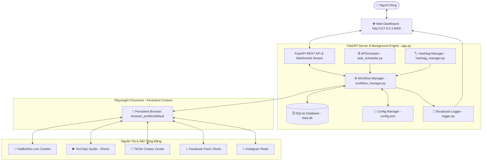

# 🗺️ SYSTEM_MAP.MD — SƠ ĐỒ HỆ THỐNG & QUY TẮC PHÁT TRIỂN

> [!IMPORTANT]
> ### 🛑 QUY TẮC ĐẦU BẢNG: BẮT BUỘC ĐỌC KỸ TRƯỚC KHI SỬA ĐỔI HOẶC NÂNG CẤP MÃ NGUỒN!
> Bất kỳ Lập trình viên hoặc AI Agent nào khi tiếp nhận dự án này **BẮT BUỘC PHẢI ĐỌC TOÀN BỘ TÀI LIỆU NÀY** trước khi chỉnh sửa bất kỳ tệp tin nào.
> 1. **KHÔNG TỰ Ý THAY ĐỔI CƠ CHẾ CHỌN SELECTOR** nếu chưa kiểm tra song ngữ (Anh - Việt) và kiểm tra lớp phủ popup (`react-joyride`, `dialog-scrim`, `reels notice`).
> 2. **LUÔN BẢO TOÀN CHẾ ĐỘ TEST (PRIVATE / UNLISTED / ONLY ME / ONLY YOU)** khi thêm mới hoặc kiểm thử tính năng đăng bài.
> 3. **MỌI THAO TÁC SỬA CODE PHẢI CHẠY KIỂM THỬ TRỰC TIẾP TRÊN TRÌNH DUYỆT THỰC TẾ** (`test_all_platforms.py`) để xác nhận không gây lỗi hồi quy (regression bugs).

---

## 📑 MỤC LỤC
1. [Sơ Đồ Kiến Trúc Hệ Thống (Architecture Diagram)](#1-sơ-đồ-kiến-trúc-hệ-thống)
2. [Bản Đồ Cấu Trúc File & Vai Trò Thực Tế (File Directory Map)](#2-bản-đồ-cấu-trúc-file--vai-trò-thực-tế)
3. [Luồng Hoạt Động Cốt Lõi (Core Workflows)](#3-luồng-hoạt-động-cốt-lõi)
4. [Các Quy Tắc Kỹ Thuật Bất Biến (Golden Technical Rules)](#4-các-quy-tắc-kỹ-thuật-bất-biến)
5. [Cấu Trúc Cơ Sở Dữ Liệu & Cấu Hình (Database & Config Schema)](#5-cấu-trúc-cơ-sở-dữ-liệu--cấu-hình)
6. [Hướng Dẫn Mở Rộng: Thêm Nền Tảng Mới (Adding New Platforms)](#6-hướng-dẫn-mở-rộng-thêm-nền-tảng-mới)
7. [Bảng Tra Cứu & Khắc Phục Lỗi Nhanh (Troubleshooting Cheatsheet)](#7-bảng-tra-cứu--khắc-phục-lỗi-nhanh)

---

## 1. SƠ ĐỒ KIẾN TRÚC HỆ THỐNG



---

## 2. BẢN ĐỒ CẤU TRÚC FILE & VAI TRÒ THỰC TẾ

```
├── Tu_dong_dang_video.exe      # File thực thi nhị phân chính (Chạy ngầm + System Tray Icon + Mở Web)
├── tray_app.py                 # Module System Tray Icon khay hệ thống (pystray + FastAPI runner)
├── build_exe.bat               # Script PyInstaller tự động biên dịch Tu_dong_dang_video.exe
├── run.bat                     # Launcher 1-click khởi động phần mềm và mở Web Dashboard
├── bootstrap.ps1               # Engine khởi tạo môi trường (tự tải Python/Chromium nếu thiếu & chạy server)
├── run_hidden.vbs              # Script VBScript chạy ngầm khi Windows khởi động (không hiện cmd đen)
├── enable_autostart.bat        # Script 1-click bật tự động khởi động cùng Windows
├── disable_autostart.bat       # Script 1-click tắt tự động khởi động cùng Windows
├── package_portable.bat        # Script tự động tải Python Embedded và nén thành Auto_Video_Pro_Portable.zip
├── quick_install.ps1           # Script PowerShell cài đặt siêu tốc 1 dòng lệnh từ xa
├── install.bat                 # Script cài đặt môi trường độc lập
├── update.bat                  # Script 1-click cập nhật mã nguồn độc lập từ GitHub
├── backup_to_github.bat        # Script 1-click đẩy mã nguồn mới nhất lên GitHub (ngonco/dangvideo)
├── README.md                   # Hướng dẫn cài đặt và chạy trên nhiều máy tính
├── SYSTEM_MAP.MD               # [TÀI LIỆU NÀY] Bản đồ hệ thống và quy tắc phát triển bắt buộc
├── test_all_platforms.py       # Script kiểm thử độc lập luồng đăng 4 nền tảng với dữ liệu thực tế
│
├── core/                       # Các module hạ tầng cốt lõi
│   ├── __init__.py
│   ├── autostart_manager.py    # Quản lý tạo/xóa Windows Startup Shortcut (Auto-start with Windows)
│   ├── config_manager.py       # Đọc/ghi cấu hình config.json an toàn với fallback mặc định
│   ├── database.py             # SQLite helper: quản lý bảng videos, post_history, stats, clean_old_posted_videos
│   └── logger.py               # Logger trung tâm hỗ trợ stream realtime qua WebSocket và in màu console
│
├── automation/                 # Động cơ tự động hóa trình duyệt
│   ├── __init__.py
│   ├── browser_engine.py       # Khởi tạo Playwright Chromium Persistent Context (thư mục profile/default)
│   ├── hashtag_manager.py      # Sinh bộ hashtag đạo lý/phật pháp ngẫu nhiên theo chủ đề kịch bản
│   ├── hatbuinho_crawler.py    # Tự động đăng nhập, duyệt modal, lấy tiêu đề sạch và tải video từ HatBuiNho
│   ├── workflow_manager.py     # Điều phối luồng tải video và phân phối đăng độc lập từng nền tảng
│   │
│   └── posters/                # Các module đăng bài cho từng nền tảng cụ thể
│       ├── __init__.py
│       ├── base_poster.py      # Lớp trừu tượng Poster cơ sở & hàm ghép Caption/Hashtags
│       ├── youtube_poster.py   # Upload YouTube Shorts, xử lý 3 bước Next, Audience, AI use, bóc tách link shorts
│       ├── tiktok_poster.py    # Upload TikTok, xóa react-joyride overlay, bật AI, quyền riêng tư Only you
│       ├── facebook_poster.py  # Upload Facebook, xử lý feed dialog, quyền riêng tư Chỉ mình tôi
│       └── instagram_poster.py # Upload Instagram Reels, Native FileChooser, đóng Reels notice dialog
│
├── scheduler/                  # Lập lịch tự động chạy nền
│   ├── __init__.py
│   └── task_scheduler.py       # Lập lịch giờ vàng (08:00, 11:30, 19:30), quét định kỳ, tự động dọn dẹp 00:05
│
├── static/                     # Giao diện người dùng Web Dashboard (Glassmorphism)
│   ├── index.html              # HTML giao diện chính (Videos, Settings, Accounts Hub, Live Logs, Links Modal)
│   ├── css/
│   │   └── style.css           # Bảng phong cách Dark Glassmorphism, Responsive, Animations
│   └── js/
│       └── app.js              # Xử lý tương tác giao diện, WebSocket realtime, gọi API REST, hiển thị Links Modal
│
├── downloads/                  # Thư mục lưu trữ các tệp video .mp4 đã tải về
├── browser_profiles/           # Thư mục lưu phiên đăng nhập Chrome (User Data Directory)
│   └── default/                # Cookie, LocalStorage và Session của tất cả tài khoản mạng xã hội
└── scratch/                    # Thư mục chứa các script kiểm thử chẩn đoán độc lập
```

---

## 3. LUỒNG HOẠT ĐỘNG CỐT LÕI

### 3.1. Luồng Tải Video Từ HatBuiNho (`automation/hatbuinho_crawler.py`)
1. Mở trang `https://hatbuinho.com/`. Kiểm tra trạng thái đăng nhập (User: `cun`, Pass: `123`).
2. Tự động đóng popup thông báo hệ thống (`Đã đọc`).
3. Mở danh sách lịch sử video bằng `toggleHistory()` và chuyển sang tab `history_tab_done` (Đã xong).
4. Duyệt các video:
   - **Chế độ Chuẩn**: Chỉ duyệt video có nhãn `Chưa tải xuống`.
   - **Chế độ Test (`force_latest=True`)**: Ép duyệt video đầu tiên kể cả khi đã có nhãn `Đã tải xuống`.
5. Mở popup chi tiết, lấy Tiêu đề từ `#download_title_hashtag_suggestions` (nếu web chưa có gợi ý AI thì tự động trích câu mở đầu hoàn chỉnh, không cắt cụt từ qua `_extract_clean_first_sentence`).
6. Tự động sinh bộ **Hashtag Đạo Lý & Phật Pháp** ngẫu nhiên qua `hashtag_mgr.get_random_hashtags()`.
7. Bấm nút `#btn_confirm_download_2` (*Tải xuống 2 - có tên*) và lưu tệp `.mp4` vào thư mục `downloads/`.
8. Lưu bản ghi vào bảng `videos` trong cơ sở dữ liệu `data.db`.

### 3.2. Luồng Đăng Đa Nền Tảng (`automation/workflow_manager.py`)
1. Nhận yêu cầu đăng `video_id` và danh sách `target_platforms` (`["youtube", "tiktok", "facebook", "instagram"]`).
2. Khởi tạo một phiên `page` độc lập cho từng nền tảng (đảm bảo lỗi của 1 nền tảng không làm gián đoạn các nền tảng còn lại).
3. Đăng tuần tự:
   - **YouTube Shorts**: Upload -> Điền tiêu đề + `#Shorts` -> Chọn `Not made for kids` -> Mở `SHOW MORE` -> Chọn `AI use -> Yes` -> Chuyển tiếp 3 bước Next -> Chọn `UNLISTED` -> Bấm Publish -> Bóc tách link thật `https://youtube.com/shorts/<VIDEO_ID>`.
   - **TikTok**: Upload -> Xóa bỏ `react-joyride` overlay -> Điền Caption/Hashtags -> Bật `AI-generated content` -> Đặt quyền riêng tư `Only you` -> Bấm Post -> Bóc tách link thật `https://www.tiktok.com/@me/video`.
   - **Facebook**: Mở feed -> Bấm tạo bài viết -> Đính kèm video -> Điền Caption/Hashtags -> Đặt quyền riêng tư `Chỉ mình tôi` -> Đóng sub-dialog -> Bấm Post -> Bóc tách link thật `https://www.facebook.com/reel/?s=tab`.
   - **Instagram**: Mở Create -> Submenu Post -> Kích hoạt `page.expect_file_chooser()` -> Đính kèm video -> Đóng popup thông báo Reels -> Next (Crop) -> Next (Filter) -> Điền Caption -> Bấm Share -> Bóc tách link thật `https://www.instagram.com/p/<CODE>/`.
4. Ghi nhận kết quả, đường dẫn thực tế hoặc lỗi vào bảng `post_history`.

### 3.3. Luồng Tự Động Dọn Dẹp Ổ Cứng Sau 2 Ngày (`scheduler/task_scheduler.py`)
1. Kích hoạt tự động lúc `00:05` hàng ngày hoặc khi server khởi động (hoặc người dùng bấm *Dọn Dẹp Ngay* trên giao diện).
2. Lọc các video có trạng thái `posted` hoặc có lịch sử đăng thành công cũ hơn `retention_days` (mặc định: 2 ngày).
3. Xóa tệp `.mp4` vật lý trong `downloads/` để giải phóng dung lượng ổ cứng.
4. Cập nhật `file_path = ''` và `status = 'cleaned'` trong `data.db` (Giữ nguyên 100% dữ liệu lịch sử, tiêu đề và link bài đăng).

---

## 4. CÁC QUY TẮC KỸ THUẬT BẤT BIẾN

> [!CAUTION]
> Bất kỳ lập trình viên hoặc AI Agent nào khi chỉnh sửa mã nguồn của dự án này **BẮT BUỘC PHẢI TUÂN THỦ** các quy tắc dưới đây:

### 🚫 Quy Tắc 1: Cấm Dùng Cờ Regex `i` Trong Selector Playwright
- **Sai:** `page.locator('button:has-text("Đăng" i)')` — *Gây lỗi nghiêm trọng `Unexpected token "i" while parsing css selector`.*
- **Đúng:** `page.locator('button:has-text("Đăng"), button:has-text("dang")')` hoặc dùng JavaScript evaluation `page.evaluate(...)` so sánh `.toLowerCase()`.

### 🛡️ Quy Tắc 2: Luôn Xử Lý Lớp Phủ Chặn Con Trỏ (Overlay / Joyride / Scrim)
- Trên **TikTok**: Luôn gọi `_dismiss_overlays(page)` trước khi tương tác để xóa bỏ `#react-joyride-portal` và `.react-joyride__overlay`.
- Trên **Instagram**: Luôn gọi `_dismiss_ig_dialogs(page)` để đóng popup "Video posts are now shared as reels".
- Trên **YouTube Studio**: Sử dụng `click(force=True)` hoặc `evaluate(...)` để tránh bị `dialog-scrim` chặn sự kiện click.

### 🌐 Quy Tắc 3: Đảm Bảo Hỗ Trợ Đa Ngôn Ngữ (Song Ngữ Anh - Việt)
- Giao diện người dùng của các nền tảng mạng xã hội (đặc biệt là YouTube Studio và Facebook) có thể hiển thị bằng tiếng Anh hoặc tiếng Việt tùy thuộc vào IP/tài khoản.
- Mọi bộ chọn (Selectors) cho nút bấm hoặc nhãn bắt buộc phải khai báo song ngữ.
  - *Ví dụ Audience YouTube:* `VIDEO_MADE_FOR_KIDS_NOT_MFK`, `No, it's not made for kids`, `Không, đây không phải nội dung dành cho trẻ em`.
  - *Ví dụ Nút Đăng:* `NEXT / TIẾP`, `SAVE / PUBLISH / LƯU / XUẤT BẢN`.

### 📂 Quy Tắc 4: Kích Hoạt Hộp Thoại Tệp (File Chooser) Cho Dropzone Instagram
- Các giao diện web sử dụng thành phần kéo thả tùy biến không cho phép gắn trực tiếp vào `input[type="file"]` (ví dụ Instagram) **bắt buộc** phải sử dụng cơ chế:
  ```python
  async with page.expect_file_chooser(timeout=15000) as fc_info:
      await select_btn.click()
  file_chooser = await fc_info.value
  await file_chooser.set_files(file_path)
  ```

### 🔒 Quy Tắc 5: Duy Trì Chế Độ Test Mặc Định (Chưa Public)
- Khi phát triển và kiểm thử, toàn bộ 4 nền tảng phải luôn giữ mặc định chế độ riêng tư:
  - YouTube: `UNLISTED`
  - TikTok: `ONLY YOU`
  - Facebook: `ONLY ME`
  - Instagram: `PRIVATE`

### 🔄 Quy Tắc 6: Bảo Toàn Phiên Trình Duyệt Độc Lập Giữa Các Nền Tảng
- Trong vòng lặp `publish_video_to_platforms`, mỗi nền tảng phải được bọc trong khối `try...except` riêng và đảm bảo trang `page` còn sống trước khi thực thi. Một nền tảng thất bại tuyệt đối không được làm dừng các nền tảng tiếp theo.

---

## 5. CẤU TRÚC CƠ SỞ DỮ LIỆU & CẤU HÌNH

### 5.1. Bảng `videos` trong `data.db`
| Tên Cột | Kiểu Dữ Liệu | Mô Tả |
| :--- | :--- | :--- |
| `id` | `INTEGER PRIMARY KEY` | Khóa chính tự tăng |
| `hatbuinho_id` | `TEXT UNIQUE` | Mã băm định danh video trên HatBuiNho |
| `title` | `TEXT` | Tên tệp video gốc |
| `raw_script` | `TEXT` | Nội dung kịch bản văn bản trích từ web |
| `suggested_title` | `TEXT` | Tiêu đề hoàn chỉnh đã làm sạch |
| `hashtags` | `TEXT` | Bộ hashtag đạo lý ngẫu nhiên |
| `file_path` | `TEXT` | Đường dẫn tuyệt đối tệp `.mp4` trong `downloads/` |
| `file_size` | `INTEGER` | Dung lượng tệp video (bytes) |
| `status` | `TEXT` | `downloaded` (Đã tải) \| `posted` (Đã đăng) \| `cleaned` (Đã dọn dẹp file) |
| `created_date_str` | `TEXT` | Thời gian tạo trên hệ thống |
| `downloaded_at` | `TIMESTAMP` | Thời điểm tải về máy |

### 5.2. Bảng `post_history` trong `data.db`
| Tên Cột | Kiểu Dữ Liệu | Mô Tả |
| :--- | :--- | :--- |
| `id` | `INTEGER PRIMARY KEY` | Khóa chính tự tăng |
| `video_id` | `INTEGER` | Khóa ngoại liên kết bảng `videos(id)` |
| `platform` | `TEXT` | Tên nền tảng (`youtube`, `tiktok`, `facebook`, `instagram`) |
| `status` | `TEXT` | `success` (Thành công) \| `failed` (Thất bại) |
| `post_url` | `TEXT` | Đường link thực tế của bài đăng |
| `error_message` | `TEXT` | Chi tiết lỗi nếu đăng thất bại |
| `posted_at` | `TIMESTAMP` | Thời điểm đăng bài |

---

## 6. HƯỚNG DẪN MỞ RỘNG: THÊM NỀN TẢNG MỚI

Khi bạn muốn tích hợp thêm một nền tảng mạng xã hội mới (Ví dụ: **Threads**, **Pinterest**, **X/Twitter**):

1. **Tạo Poster Mới:**
   - Tạo file mới trong `automation/posters/` (Ví dụ: `threads_poster.py`).
   - Kế thừa lớp `BasePoster` và triển khai phương thức `post_video(page: Page, video_data: Dict[str, Any])`.
2. **Khai Báo Cấu Hình trong `config.json`:**
   - Thêm trường cấu hình cho nền tảng mới trong mục `platforms` (kèm `enabled`, `privacy`, `mark_ai`).
3. **Đăng Ký Vào `WorkflowManager` (`automation/workflow_manager.py`):**
   - Import poster mới và thêm vào nhánh điều kiện trong `publish_video_to_platforms`.
4. **Cập Nhật Giao Diện Web (`static/index.html` & `static/js/app.js`):**
   - Thêm checkbox kích hoạt nền tảng trong tab *Cài Đặt*.
   - Thêm checkbox nền tảng trong Modal đăng nhanh (`postModal`).
   - Thêm logo/badge và hỗ trợ hiển thị link trong Modal xem link (`linksModal`).

---

## 7. BẢNG TRA CỨU & KHẮC PHỤC LỖI NHANH

| Hiện Tượng Lỗi | Nguyên Nhân Gốc Rễ | Cách Khắc Phục Chuẩn |
| :--- | :--- | :--- |
| `Failed to create a ProcessSingleton for your profile directory` | Cửa sổ Chrome đang chạy nền hoặc `run.bat` đang giữ khóa thư mục `browser_profiles/default`. | Đóng trình duyệt Chrome hoặc chạy lệnh `taskkill /F /IM chrome.exe` trong cmd rồi thử lại. |
| `Locator.click: Target page, context or browser has been closed` | Lớp phủ quảng cáo / hướng dẫn (`react-joyride`) chặn click khiến Playwright chờ quá thời gian và timeout. | Đảm bảo gọi `_dismiss_overlays(page)` trước khi click và dùng `click(force=True)`. |
| Tiêu đề video bị cắt cụt từ giữa chừng | Trích xuất chuỗi cứng theo số ký tự mà không kiểm tra ranh giới từ (word boundary). | Dùng hàm `_extract_clean_first_sentence` trong `hatbuinho_crawler.py` để ngắt câu theo từ hoàn chỉnh. |
| YouTube không chuyển sang bước Visibility | Nút `Next` bị che khuất hoặc vòng lặp thoát sớm do kiểm tra selector sai. | Dùng `page.evaluate()` click trực tiếp `document.getElementById('next-button')` tuần tự 3 lần. |
| Không tìm thấy `input[type="file"]` trên Instagram | Instagram sử dụng component tùy biến cần bấm *Select from computer* để mở file picker. | Sử dụng `async with page.expect_file_chooser()` trước khi click nút chọn tệp. |

---

*Tài liệu này được biên soạn và chuẩn hóa tự động cho toàn bộ vòng đời phát triển của dự án Auto Video Pro.*
