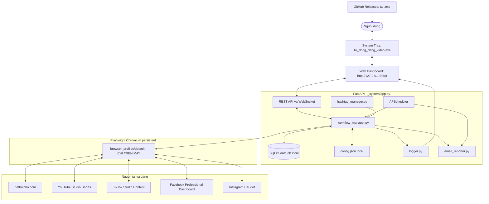

# SYSTEM_MAP.MD — SƠ ĐỒ HỆ THỐNG & QUY TẮC PHÁT TRIỂN

> [!IMPORTANT]
> ### QUY TẮC ĐẦU BẢNG: BẮT BUỘC ĐỌC KỸ TRƯỚC KHI SỬA ĐỔI HOẶC NÂNG CẤP MÃ NGUỒN
> 1. **KHÔNG TỰ Ý THAY ĐỔI CƠ CHẾ CHỌN SELECTOR** nếu chưa kiểm tra song ngữ (Anh - Việt) và lớp phủ popup (`react-joyride`, `dialog-scrim`, dialog Instagram).
> 2. **LUỒNG SẢN XUẤT:** YouTube / TikTok / Facebook hẹn native **công khai 10:00 sáng mai**. Instagram web **Share ngay** (Bài viết). Không Unlisted / Only you / Only me.
> 3. **CHỐNG ĐĂNG TRÙNG:** Video sau khi đăng cập nhật `posted` và không được chọn đăng lại.
> 4. **BỘ LỌC AN TOÀN:** Chế độ tự động hàng ngày chỉ tải video tạo **trước hôm nay** (`exclude_today = True`).
> 5. **KIỂM THỬ TRÊN TRÌNH DUYỆT THẬT** (`test_*_retry.py` / `test_full_suite.py` hoặc `.exe`).
> 6. **KHÔNG ĐẨY LÊN GITHUB:** cookie / `browser_profiles`, `.env`, `config.json` (mật khẩu), `data.db`, `.exe`. User tải `.exe` từ **GitHub Releases**, không từ git.

---

## MỤC LỤC
1. [Sơ Đồ Kiến Trúc Hệ Thống](#1-sơ-đồ-kiến-trúc-hệ-thống)
2. [Bản Đồ Cấu Trúc File](#2-bản-đồ-cấu-trúc-file)
3. [GitHub Release — User tải về & chống leak](#3-github-release--user-tải-về--chống-leak)
4. [Hai Chế Độ Đăng & Luồng Cốt Lõi](#4-hai-chế-độ-đăng--luồng-cốt-lõi)
5. [Kho Hàng Đợi FIFO & Chống Đăng Trùng](#5-hệ-thống-kho-hàng-đợi-fifo--chống-đăng-trùng)
6. [Báo Cáo Email](#6-module-độc-lập-báo-cáo-email)
7. [REST API & WebSocket](#7-danh-sách-rest-api--websocket)
8. [Giao Diện Dashboard](#8-giao-diện-dashboard)
9. [Quy Tắc Kỹ Thuật Bất Biến](#9-các-quy-tắc-kỹ-thuật-bất-biến)
10. [Cơ Sở Dữ Liệu & Cấu Hình](#10-cấu-trúc-cơ-sở-dữ-liệu--cấu-hình)
11. [Khắc Phục Lỗi Nhanh](#11-bảng-tra-cứu--khắc-phục-lỗi-nhanh)

---

## 1. SƠ ĐỒ KIẾN TRÚC HỆ THỐNG



---

## 2. BẢN ĐỒ CẤU TRÚC FILE

```
Auto_Dang_video/
├── README.md                   # Link tải Releases + hướng dẫn user
├── Huong_dan_su_dung.txt
├── .gitignore                   # Chặn cookie, config.json, .exe, .env, data.db
├── Tu_dong_dang_video.exe       # CHỈ trên máy / GitHub Release — KHÔNG commit git
├── downloads/                  # Video .mp4 (gitignore nội dung)
│
└── _system/
    ├── app.py                  # FastAPI: REST, WebSocket logs
    ├── tray_app.py             # Tray icon + uvicorn 127.0.0.1:8000
    ├── config.json             # Local: mật khẩu HatBuiNho — gitignore
    ├── config.example.json      # Mẫu public: username/password trống
    ├── .env                    # VILAO_API_KEY — gitignore
    ├── .env.example            # Mẫu public
    ├── data.db                 # SQLite local — gitignore
    ├── VERSION                 # Số phiên bản; publish tự tăng số giữa (1.2.0 → 1.3.0)
    ├── SYSTEM_MAP.MD           # Tài liệu này
    ├── build_exe.py           # PyInstaller onefile (add-data: static + config.example.json + VERSION)
    ├── build_exe.bat
    ├── publish_github_release.py   # CÁCH PHÁT HÀNH CHÍNH THỨC: đóng gói exe + Release
    ├── publish_github_release.bat
    ├── run.bat
    ├── backup_to_github.bat   # Chỉ đẩy mã nguồn (không .exe); ưu tiên dùng publish_github_release
    ├── requirements.txt
    ├── test_full_suite.py
    ├── test_fb_retry.py / test_tt_retry.py / test_ig_retry.py
    │
    ├── core/
    │   ├── config_manager.py   # DEFAULT_CONFIG username/password trống; đọc config.json local
    │   ├── database.py
    │   ├── email_reporter.py
    │   ├── schedule_helper.py   # Native 10:00 sáng mai; Instagram min_gap_hours
    │   ├── logger.py
    │   └── autostart_manager.py
    │
    ├── automation/
    │   ├── browser_engine.py  # Persistent Chromium, --mute-audio, profile local
    │   ├── hashtag_manager.py   # Kho đạo lý + gộp hashtag AI khi tải
    │   ├── hatbuinho_crawler.py
    │   ├── ai_fallback.py      # Hashtag AI khi tải; recover UI khi lỗi
    │   ├── workflow_manager.py
    │   └── posters/
    │       ├── base_poster.py  # caption = tiêu đề + hashtags; append_text mặc định trống
    │       ├── youtube_poster.py
    │       ├── tiktok_poster.py
    │       ├── facebook_poster.py
    │       └── instagram_poster.py
    │
    ├── scheduler/task_scheduler.py
    ├── static/                 # Dashboard (index.html, css, js)
    └── browser_profiles/default/  # Cookie phiên đăng nhập — gitignore, KHÔNG lên GitHub
```

---

## 3. GITHUB RELEASE — USER TẢI VỀ & CHỐNG LEAK

Repo: https://github.com/ngonco/dangvideo

### User tải và cài

- **Link tải .exe:** https://github.com/ngonco/dangvideo/releases/latest
- File: `Tu_dong_dang_video.exe` (ví dụ `v1.2.0`).
- Click đúp → Dashboard `http://127.0.0.1:8000` → điền HatBuiNho trên Dashboard → **Mở Trình Duyệt Đăng Nhập** từng kênh một lần.
- Mã nguồn (không gồm .exe): ZIP nhánh `main`. Copy `config.example.json` → `config.json` nếu chạy từ Python.

### Phát hành bản mới — cách chính thức duy nhất

Không làm tay từng bước. Sau khi sửa code, **chỉ chạy**:

```
python _system/publish_github_release.py
```

hoặc click [`_system/publish_github_release.bat`](publish_github_release.bat).

**Tự tăng version:** mỗi lần chạy (không `--tag`) script tăng **số giữa trước khi đóng gói**: `1.2.0` → `1.3.0` → `1.4.0`. Ghi `_system/VERSION` và nhãn Dashboard. Tag GitHub đã có thì tăng tiếp đến khi trống. Không ghi đè Release cũ.

Muốn chỉ định số (không tự tăng):

```
python _system/publish_github_release.py --tag v1.5.0
```

Script lần lượt:

1. Kiểm tra repo `ngonco/dangvideo`, nhánh `main`.
2. Tự tăng VERSION (số giữa) rồi đóng gói `Tu_dong_dang_video.exe` bằng `build_exe.py` (`--noconsole --onefile`; `--add-data config.example.json` + `VERSION` — không nhét mật khẩu local). Dashboard trong `.exe` hiện đúng số mới.
3. `git add` mã nguồn (gitignore chặn cookie/mật khẩu/.exe) → commit nếu có thay đổi → `git push origin main`.
4. Tạo GitHub Release, đính `.exe`. Không ghi đè tag cũ.
5. In link `releases/latest`.

Không cần sửa `_system/VERSION` tay. Dashboard đọc file này qua `/api/system/version`.

Không `git add` các mục gitignore dưới đây. Không in token GitHub. User lấy file từ Releases, không từ git.

### Cấm đưa lên GitHub

| Mục | Lý do |
| :--- | :--- |
| `_system/browser_profiles/` | Cookie / session YouTube, TikTok, Facebook, Instagram, HatBuiNho |
| `_system/config.json` | Mật khẩu HatBuiNho trên máy |
| `_system/.env` | `VILAO_API_KEY` |
| `_system/data.db` | Lịch sử đăng local |
| `Tu_dong_dang_video.exe` | File lớn; phát hành qua Releases |
| `downloads/*.mp4`, `debug_screenshots/`, `temp_record_action/` | Dữ liệu máy |

Public trên git: `config.example.json` (username/password trống), `.env.example`, mã nguồn, README.

`DEFAULT_CONFIG` trong `config_manager.py` cũng để username/password **trống**. Lần đầu chạy `.exe` tự tạo `config.json` local.

---

## 4. HAI CHẾ ĐỘ ĐĂNG & LUỒNG CỐT LÕI

### 4.1. Đăng tự động hàng ngày
- Mặc định `auto_mode = true`. Tới mốc giờ (`08:00`, `11:30`, `19:30`…): 1 video/lần.
- Kho rỗng → `scan_and_download(..., exclude_today=True)` (bỏ video tạo hôm nay).
- YT / TT / FB: tải lên ngay, hẹn native **10:00 sáng mai công khai**. Instagram: Bài viết Share ngay; chạy thật cách **3 tiếng**.

### 4.2. Đăng hàng loạt theo lịch
- Nút Dashboard → `POST /api/action/batch-download-queue` (tối đa 50 video Chưa tải xuống). Scheduler đăng FIFO theo mốc giờ.

### 4.3. Đăng 1 video ngay
- `POST /api/action/run-workflow` (`mode=normal`): ưu tiên Chưa tải xuống (hết thì video mới nhất) hoặc kho. `enforce_ig_gap=True`. Hẹn native theo `schedule_publish.default_time` (mặc định 10:00).

---

## 5. HỆ THỐNG KHO HÀNG ĐỢI FIFO & CHỐNG ĐĂNG TRÙNG

- FIFO: `status = 'downloaded' ORDER BY id ASC LIMIT 1`.
- 3 lớp: `hatbuinho_id UNIQUE` → `status = posted` → `post_history` theo nền tảng.

---

## 6. MODULE ĐỘC LẬP BÁO CÁO EMAIL

- SMTP: `binhyentram89@gmail.com` (Gmail SSL 465). Admin: `thv.vinh@gmail.com`.
- `send_error_alert` khi lỗi kênh; `send_daily_summary` lúc 22:00.

---

## 7. DANH SÁCH REST API & WEBSOCKET

| Method | Đường dẫn | Chức năng |
| :--- | :--- | :--- |
| `GET` | `/` | Dashboard |
| `GET` | `/media/{filename}` | File video trong `downloads/` |
| `GET` | `/api/system/version` | Phiên bản |
| `GET` | `/api/stats` | Số liệu tổng |
| `GET` | `/api/videos` | Danh sách video kho |
| `GET` | `/api/videos/{video_id}/history` | Lịch sử theo 1 video |
| `GET`/`POST` | `/api/config` | Đọc/lưu `config.json` local |
| `GET` | `/api/accounts/status` | Cookie/session các kênh |
| `GET` | `/api/history` | Lịch sử đăng |
| `GET` | `/api/queue/summary` | Kho hàng đợi |
| `GET` | `/api/logs` | Nhật ký |
| `GET`/`POST` | `/api/system/autostart` | Trạng thái / bật tắt khởi động Windows |
| `POST` | `/api/schedule/timeslots` | Mốc giờ + reload scheduler |
| `POST` | `/api/action/toggle-scheduler` | Bật/tắt auto |
| `POST` | `/api/action/scan` | Quét HatBuiNho |
| `POST` | `/api/action/post` | Đăng video đã chọn |
| `POST` | `/api/action/run-workflow` | Đăng 1 video (ưu tiên kho / chưa tải) |
| `POST` | `/api/action/batch-download-queue` | Tải hàng loạt vào kho |
| `POST` | `/api/action/cleanup` / `cleanup-old-videos` | Dọn mp4 cũ |
| `POST` | `/api/action/send-test-email` | Email thử |
| `POST` | `/api/action/open-login` | Mở URL đăng nhập |
| `POST` | `/api/browser/open-login/{platform}` | Mở trình duyệt persistent theo kênh |
| `POST` | `/api/system/update` | Kéo mã nguồn GitHub |
| `WS` | `/ws/logs` | Nhật ký realtime |

---

## 8. GIAO DIỆN DASHBOARD

Một trang: 3 nút (Bật/Tắt tự động, Hàng loạt, Đăng 1 video ngay), mốc giờ, accordion đăng nhập 5 kênh (HatBuiNho + 4 MXH), lịch sử, nhật ký WebSocket.

---

## 9. CÁC QUY TẮC KỸ THUẬT BẤT BIẾN

### Quy Tắc 1: Cấm regex `i` trong selector Playwright
- Sai: `button:has-text("Đăng" i)`. Đúng: hai locator Anh/Việt hoặc `page.evaluate`.

### Quy Tắc 2: Overlay
- TikTok: `_dismiss_overlays`. Instagram: `_dismiss_ig_dialogs`. YouTube: `click(force=True)` / `evaluate`.

### Quy Tắc 3: Song ngữ Anh - Việt

### Quy Tắc 4: Hẹn native công khai 10:00 sáng mai (trừ Instagram)
- **YouTube / TikTok / Facebook:** Schedule / Lên lịch ngày mai 10:00, công khai. Facebook: `#prodash-create-button` → Reel → 2 Next → Publish now → Date/Time → helper text đóng lịch → Schedule for later → Schedule footer (không Post). Copy link `aria-label="Actions for this post"`. TikTok: `tiktokstudio/content` → Tải lên → `#panel-video input[type=file]` → radio `postSchedule=schedule` → timepicker → `post_video_button` Lên lịch; copy link tab Bài đăng.
- **Instagram:** Bài viết / Post (không Story/Reel). Không `[role=switch]`, không Cài đặt nâng cao. Share / Chia sẻ (đúng chữ, không sheet Chia sẻ bài viết). Xong / Done → mở ô lưới đầu → `page.url` (`/p/` hoặc `/reel/`). Chạy thật: `instagram.min_gap_hours=3`.
- `schedule_publish`: `enabled=true`, `default_time=10:00`, `target_date=tomorrow`.

### Quy Tắc 5: DummyWriter khi `--noconsole`

### Quy Tắc 6: Auto mode `exclude_today=True`. Nút thủ công cho phép video hôm nay.

### Quy Tắc 7: HatBuiNho cookie-first
- Có `#btn_view_history` thì không điền form. Thiếu username/password trên Dashboard thì không spam login. Đóng Đã đọc → Video → tab Đã xong.
- **Phiên bản:** luôn bấm `.history-variant-tab` số cao nhất (Phiên bản 2/3/4/5 nếu có), rồi Tải xuống trong panel đang hiện, rồi `#btn_confirm_download_2`. Lỗi → bỏ video đó, sang video Chưa tải xuống tiếp theo (không lui về bản 1).

### Quy Tắc 8: AI Vilao
- **Khi tải:** `suggest_popular_hashtags` — 3–5 hashtag phổ biến, gộp với kho đạo lý (`#luatnhanqua`, `#loiphatday`…). Thiếu `VILAO_API_KEY` → chỉ kho đạo lý, không chặn tải. Cấm `#hatbuinho` / chữ ký thương hiệu (`custom_caption.append_text` mặc định trống).
- **Khi lỗi UI:** `diagnose_and_recover` tối đa 8 bước. Instagram được phép bấm Share. Không xử lý được → email + skip kênh.

### Quy Tắc 9: Không leak khi push GitHub
- Không `git add` cookie, `.env`, `config.json`, `data.db`, `.exe`. Phát hành `.exe` bằng GitHub Release.

---

## 10. CẤU TRÚC CƠ SỞ DỮ LIỆU & CẤU HÌNH

### 10.1. Bảng `videos`
| Cột | Kiểu | Mô tả |
| :--- | :--- | :--- |
| `id` | INTEGER PK | |
| `hatbuinho_id` | TEXT UNIQUE | |
| `title` / `raw_script` / `suggested_title` | TEXT | |
| `hashtags` | TEXT | Đạo lý + AI phổ biến khi tải |
| `file_path` / `file_size` | | `downloads/` |
| `status` | TEXT | `downloaded` / `posted` / `cleaned` |

### 10.2. Bảng `post_history`
`platform` = youtube / tiktok / facebook / instagram. `status` = success / failed / skipped. `post_url` = permalink.

### 10.3. Cấu hình
- Local: `_system/config.json` (gitignore). Mẫu: `config.example.json`.
- `browser.headless=true` (mặc định): ẩn cửa sổ khi tải/đăng. Nút Dashboard **HIỂN THỊ QUÁ TRÌNH ĐĂNG** bật cửa sổ. **Mở Trình Duyệt Đăng Nhập** luôn hiện.
- `browser.mute_audio=true` (mặc định): Chromium Playwright `--mute-audio`. Nút Dashboard đổi được; Chrome của user không bị mute.
- `schedule_publish.default_time=10:00`, `target_date=tomorrow`.
- `custom_caption.append_text` trống (không `#hatbuinho`).
- `platforms.instagram.min_gap_hours=3`.

---

## 11. BẢNG TRA CỨU & KHẮC PHỤC LỖI NHANH

| Hiện tượng | Nguyên nhân | Cách xử lý |
| :--- | :--- | :--- |
| `stdout` None / `isatty` | PyInstaller `--noconsole` | `DummyWriter` trong `tray_app.py` / `logger.py` |
| `signal only works in main thread` | Uvicorn trong thread | `install_signal_handlers = lambda: None` |
| Profile Playwright bị khóa | Chromium leftover giữ `browser_profiles` | Chỉ tắt leftover `ms-playwright` / `.exe` app, không kill Chrome user |
| HatBuiNho không thấy video | Overlay Đã đọc / chưa bấm Video | `#btn_view_history` rồi `#history_tab_done` |
| TikTok draft / Continue to post | Bản nháp hoặc hộp xác nhận lịch | Discard; trong Continue to post bấm Post now (xác nhận lịch) |
| Facebook đăng tường / kẹt lịch | Sai composer; calendar che nút | Prodash Reel; helper text; Schedule footer; Copy link |
| Instagram không hẹn giờ | Web không có Lên lịch | Share ngay; copy `page.url` |
| YouTube Daily upload limit | Banner shadow DOM | Dừng kênh, email, không Next |
| User không có .exe trong git clone | `.exe` không nằm trong git | Tải https://github.com/ngonco/dangvideo/releases/latest |

Tài liệu này khớp mã nguồn hiện tại: native schedule, Instagram permalink thanh địa chỉ, hashtag AI khi tải, phát hành `.exe` qua GitHub Releases.
