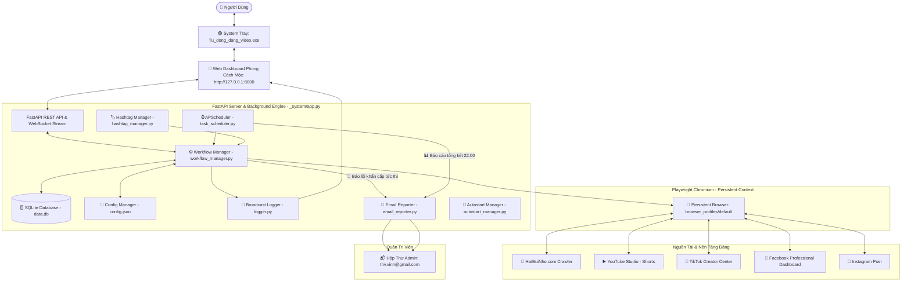

# 🗺️ SYSTEM_MAP.MD — SƠ ĐỒ HỆ THỐNG & QUY TẮC PHÁT TRIỂN

> [!IMPORTANT]
> ### 🛑 QUY TẮC ĐẦU BẢNG: BẮT BUỘC ĐỌC KỸ TRƯỚC KHI SỬA ĐỔI HOẶC NÂNG CẤP MÃ NGUỒN!
> Bất kỳ Lập trình viên hoặc AI Agent nào khi tiếp nhận dự án này **BẮT BUỘC PHẢI ĐỌC TOÀN BỘ TÀI LIỆU NÀY** trước khi chỉnh sửa bất kỳ tệp tin nào.
> 1. **KHÔNG TỰ Ý THAY ĐỔI CƠ CHẾ CHỌN SELECTOR** nếu chưa kiểm tra song ngữ (Anh - Việt) và kiểm tra lớp phủ popup (`react-joyride`, `dialog-scrim`, `reels notice`).
> 2. **LUÔN BẢO TOÀN CHẾ ĐỘ TEST (PRIVATE / UNLISTED / ONLY ME / ONLY YOU)** khi thêm mới hoặc kiểm thử tính năng đăng bài.
> 3. **CHỐNG ĐĂNG TRÙNG TUYỆT ĐỐI:** Mọi video sau khi đăng phải được cập nhật trạng thái `posted` và không bao giờ được chọn đăng lại.
> 4. **BỘ LỌC AN TOÀN TRÁNH VIDEO ĐANG SỬA DỞ:** Ở chế độ tự động hàng ngày, bắt buộc chỉ tải video tạo từ ngày hôm trước trở về trước (`exclude_today = True`).
> 5. **MỌI THAO TÁC SỬA CODE PHẢI CHẠY KIỂM THỬ TRỰC TIẾP TRÊN TRÌNH DUYỆT THỰC TẾ** (`test_all_platforms.py` hoặc chạy `.exe` test port) để xác nhận không gây lỗi hồi quy.

---

## 📑 MỤC LỤC
1. [Sơ Đồ Kiến Trúc Hệ Thống (Architecture Diagram)](#1-sơ-đồ-kiến-trúc-hệ-thống)
2. [Bản Đồ Cấu Trúc File & Vai Trò Thực Tế (File Directory Map)](#2-bản-đồ-cấu-trúc-file--vai-trò-thực-tế)
3. [Hai Chế Độ Đăng & Luồng Hoạt Động Cốt Lõi (Core Workflows)](#3-hai-chế-độ-đăng--luồng-hoạt-động-cốt-lõi)
4. [Hệ Thống Kho Hàng Đợi FIFO & Chống Đăng Trùng (Queue & Deduplication)](#4-hệ-thống-kho-hàng-đợi-fifo--chống-đăng-trùng)
5. [Module Độc Lập Báo Cáo Email (Email Reporter Module)](#5-module-độc-lập-báo-cáo-email)
6. [Danh Sách REST API & WebSocket Realtime (Endpoints Map)](#6-danh-sách-rest-api--websocket-realtime)
7. [Giao Diện Phong Cách Mộc & 3 Nút Điều Khiển (Rustic UI & Hero Controls)](#7-giao-diện-phong-cách-mộc--3-nút-điều-khiển)
8. [Các Quy Tắc Kỹ Thuật Bất Biến (Golden Technical Rules)](#8-các-quy-tắc-kỹ-thuật-bất-biến)
9. [Cấu Trúc Cơ Sở Dữ Liệu & Cấu Hình (Database & Config Schema)](#9-cấu-trúc-cơ-sở-dữ-liệu--cấu-hình)
10. [Bảng Tra Cứu & Khắc Phục Lỗi Nhanh (Troubleshooting Cheatsheet)](#10-bảng-tra-cứu--khắc-phục-lỗi-nhanh)

---

## 1. SƠ ĐỒ KIẾN TRÚC HỆ THỐNG



---

## 2. BẢN ĐỒ CẤU TRÚC FILE & VAI TRÒ THỰC TẾ

```
Auto_Dang_video/
├── Tu_dong_dang_video.exe      # File thực thi duy nhất người dùng cần click (PyInstaller native executable)
├── Huong_dan_su_dung.txt       # Hướng dẫn sử dụng 1-click ngắn gọn, thân thiện
├── downloads/                  # Thư mục lưu trữ video tải về để người dùng dễ xem trực tiếp
│   └── .gitkeep
│
└── _system/                    # THƯ MỤC HỆ THỐNG (Chứa toàn bộ mã nguồn & engine ngầm)
    ├── app.py                  # Server FastAPI trung tâm, REST API, WebSocket logs, Auto-Update API
    ├── tray_app.py             # Module System Tray Icon tím neon (pystray + FastAPI runner + Port Polling)
    ├── config.json             # Cấu hình hệ thống (tài khoản, lịch hẹn giờ, nền tảng, dọn dẹp)
    ├── data.db                 # SQLite Database lưu trữ video, lịch sử đăng, link bài viết và trạng thái
    ├── requirements.txt        # Danh sách thư viện Python phụ thuộc
    ├── SYSTEM_MAP.MD           # [TÀI LIỆU NÀY] Bản đồ hệ thống và quy tắc phát triển bắt buộc
    ├── README.md               # Hướng dẫn cài đặt và vận hành
    ├── run.bat                 # Script batch dự phòng khởi động ứng dụng
    ├── bootstrap.ps1           # Engine khởi tạo môi trường (tự tải Python/Chromium nếu thiếu & chạy server)
    ├── install.bat             # Script cài đặt môi trường
    ├── update.bat              # Script cập nhật mã nguồn độc lập từ GitHub
    ├── backup_to_github.bat    # Script 1-click đẩy mã nguồn mới nhất lên GitHub (ngonco/dangvideo)
    ├── test_all_platforms.py   # Script kiểm thử độc lập luồng đăng 4 nền tảng với dữ liệu thực tế
│
├── core/                       # Các module hạ tầng cốt lõi
│   ├── __init__.py
│   ├── autostart_manager.py    # Quản lý tự khởi động cùng Windows (Startup Shortcut)
│   ├── config_manager.py       # Đọc/ghi cấu hình config.json an toàn với fallback mặc định
│   ├── database.py             # SQLite helper: quản lý kho video, hàng đợi FIFO, chống đăng trùng, dọn dẹp cũ
│   ├── email_reporter.py       # Module độc lập: Gửi cảnh báo lỗi khẩn cấp tức thì & báo cáo ngày về thv.vinh@gmail.com
│   ├── schedule_helper.py     # Tính mốc hẹn native 10:00 sáng mai; khoảng cách Instagram 3 tiếng khi chạy thật
│   └── logger.py               # Logger trung tâm hỗ trợ stream realtime qua WebSocket và xử lý safe console
│
├── automation/                 # Động cơ tự động hóa trình duyệt
│   ├── __init__.py
│   ├── browser_engine.py       # Playwright Chromium Persistent Context & tự động phát hiện cookie đăng nhập
│   ├── hashtag_manager.py      # Kho hashtag đạo lý + gộp 3–5 hashtag phổ biến từ Vilao khi tải (không chữ ký #hatbuinho)
│   ├── hatbuinho_crawler.py    # Quét tải video HatBuiNho: cookie-first, bấm nút Video (#btn_view_history) rồi tab Đã xong, lọc exclude_today, Tải xuống 2; hashtag đạo lý + AI phổ biến
│   ├── ai_fallback.py         # AI Vilao: hashtag phổ biến khi tải; chẩn đoán lỗi UI khi timeout/exception
│   ├── workflow_manager.py     # Điều phối luồng tải video, phân phối đăng 4 kênh và kích hoạt cảnh báo lỗi
│   │
│   └── posters/                # Các module đăng bài cho từng nền tảng cụ thể
│       ├── __init__.py
│       ├── base_poster.py      # Lớp trừu tượng Poster: caption = tiêu đề + hashtags (append_text trống mặc định, không #hatbuinho)
│       ├── youtube_poster.py   # Upload YouTube Shorts + hẹn native 10:00 sáng mai công khai
│       ├── tiktok_poster.py    # Studio Content → Tải lên, #panel-video file, radio Lên lịch, picker 10:00 + ngày, post_video_button; chờ, làm tươi Bài đăng, Copy link
│       ├── facebook_poster.py  # Prodash SCHEDULED: Create→Reel, 2 Next, Publish now, Date/Time, Schedule for later + Schedule footer; chờ, làm tươi, Copy link bài vừa hẹn
│       └── instagram_poster.py # Instagram Bài viết Share ngay; sau Xong mở video, copy permalink thanh địa chỉ; chạy thật cách tối thiểu 3 tiếng/video
│
├── scheduler/                  # Lập lịch tự động chạy nền
│   ├── __init__.py
│   └── task_scheduler.py       # Lập lịch giờ vàng, quét video định kỳ, dọn dẹp 00:05, gửi báo cáo email 22:00
│
├── static/                     # Giao diện Web Dashboard (Phong cách Gỗ Ấm & Trà Thiền)
│   ├── index.html              # HTML Single-Page (Hero Card, 3 Nút, Giờ Hẹn, Accordion Đăng Nhập, Lịch Sử)
│   ├── css/
│   │   └── style.css           # Bảng phong cách Mộc dịu mắt, chữ to rõ, bo góc êm ái cho người lớn tuổi
│   └── js/
│       └── app.js              # Xử lý tương tác 1 trang, quản lý mốc giờ, hàng đợi, login 1-click, WebSocket logs
│
├── downloads/                  # Thư mục lưu trữ các tệp video .mp4 đã tải về
└── browser_profiles/           # Thư mục lưu phiên đăng nhập Chrome (User Data Directory)
    └── default/                # Cookie, LocalStorage và Session của tất cả tài khoản mạng xã hội
```

---

## 3. HAI CHẾ ĐỘ ĐĂNG & LUỒNG HOẠT ĐỘNG CỐT LÕI

### 🟢 3.1. Chế Độ 1: Đăng Tự Động Hàng Ngày (Mỗi ngày 1 lần theo giờ hẹn)
- **Kích hoạt:** Mặc định bật khi mở máy tính (`auto_mode = True`, `autostart = True`).
- **Luồng hoạt động:**
  1. Khi laptop bật lên, ứng dụng tự động chạy ngầm trong khay hệ thống (System Tray).
  2. Đến đúng các khung giờ hẹn (`08:00`, `11:30`, `19:30`...):
  3. `TaskScheduler` kích hoạt `_auto_process_next_video()`:
     - Kiểm tra giới hạn số lượng bài đăng trong ngày (`posts_today < max_posts_per_day`).
     - Tìm video chưa đăng cũ nhất trong kho SQLite (`db.get_oldest_pending_video()`).
     - **Nếu kho rỗng:** Gọi `workflow_mgr.scan_and_download(max_items=1, force_latest=False, oldest_first=True, exclude_today=True)`:
       - **Bộ Lọc An Toàn (`exclude_today = True`):** Tự động bỏ qua toàn bộ video tạo trong ngày hôm nay (để tránh video user vừa tạo nhưng vẫn đang chỉnh sửa dở trên web).
       - **Chỉ tải đúng 1 video "Chưa tải xuống" cũ nhất** được tạo **từ ngày hôm trước trở về trước**.
     - Tải file lên ngay: YouTube / TikTok / Facebook hẹn **native 10:00 sáng mai công khai**. Instagram web **không có hẹn giờ** → **Bài viết / Post, Chia sẻ ngay**, sau Xong mở video và lấy permalink thanh địa chỉ; khi chạy thật cách tối thiểu **3 tiếng**/video (test bỏ qua khoảng cách này). Mỗi lần kích hoạt chỉ 1 video — không bù hàng loạt khi máy vừa mở.
     - Lên lịch / chia sẻ xong đổi trạng thái thành `posted` trong SQLite, **tuyệt đối không bao giờ đăng trùng lại**.

### 📦 3.2. Chế Độ 2: Đăng Hàng Loạt Theo Lịch (Đa ngày)
- **Kích hoạt:** Người dùng bấm nút **`[ 📦 ĐĂNG HÀNG LOẠT THEO LỊCH ]`** trên Web Dashboard.
- **Luồng hoạt động:**
  1. Gọi `POST /api/action/batch-download-queue`.
  2. Hệ thống mở HatBuiNho, quét và tải **toàn bộ các video "Chưa tải xuống"** hiện có (tối đa 50 video/lần) về máy vào **Kho Hàng Đợi** (`status = 'downloaded'`).
  3. Hệ thống tự động phân bổ: Các video này sẽ được `TaskScheduler` tự động chia đều và đăng dần vào các khung giờ hẹn mỗi ngày theo nguyên tắc FIFO mà người dùng không cần thao tác thêm.
  4. Banner đầu trang tự cập nhật: `📦 Kho Hàng Đợi: Đang có X video trong kho (Dự kiến tự động đăng trong Y ngày tới theo các mốc giờ)`.

### ⚡ 3.3. Tác Vụ Phụ: Đăng 1 Video Ngay Lập Tức
- **Kích hoạt:** Người dùng bấm nút **`[ ⚡ ĐĂNG 1 VIDEO NGAY ]`**.
- **Luồng hoạt động:** Gọi `POST /api/action/run-workflow` (`mode = 'normal'`), ưu tiên video Chưa tải xuống trên HatBuiNho (hết thì tải video mới nhất) hoặc lấy video trong kho, tải lên YT/TT/FB **ngay** và hẹn native **10:00 sáng mai công khai**; Instagram **Bài viết Share ngay** rồi copy permalink thanh địa chỉ (có cổng 3 tiếng khi chạy thật).

---

## 4. HỆ THỐNG KHO HÀNG ĐỢI FIFO & CHỐNG ĐĂNG TRÙNG

- **Nguyên lý Hàng Đợi FIFO (First-In, First-Out):**
  - Video được chọn đăng theo thứ tự cũ nhất trước: `WHERE status = 'downloaded' ORDER BY id ASC LIMIT 1`.
- **Cơ Chế Chống Đăng Trùng 3 Lớp Tuyệt Đối:**
  1. *Lớp 1 (HatBuiNho Hash):* `hatbuinho_id TEXT UNIQUE` trong bảng `videos` ngăn tải trùng 1 video nhiều lần.
  2. *Lớp 2 (Trạng thái Video):* Video sau khi đăng thành công lập tức chuyển `status = 'posted'`. Các hàm lấy hàng đợi chỉ lọc `status = 'downloaded'`.
  3. *Lớp 3 (Lịch Sử Post History):* Ghi nhận từng bài đăng với `video_id`, `platform`, `post_url`, `status = 'success'`.

---

## 5. MODULE ĐỘC LẬP BÁO CÁO EMAIL (`email_reporter.py`)

- **Người gửi (SMTP):** `binhyentram89@gmail.com` (Gmail SSL Cổng 465).
- **Người nhận (Admin):** `thv.vinh@gmail.com`.
- **Định danh người gửi:** Tự động lấy `[Tài khoản HatBuiNho: {user} | Hostname: {hostname}]`.
- **2 Tính năng chính:**
  1. **🚨 Cảnh báo lỗi khẩn cấp tức thì (`send_error_alert`):** Gửi ngay khi có lỗi phát sinh ở bất kỳ nền tảng nào (kèm traceback và cơ chế chống spam 10 phút).
  2. **📊 Báo cáo tổng kết ngày (`send_daily_summary`):** Tự động gửi lúc 22:00 mỗi ngày tổng hợp danh sách video đã đăng kèm link bài viết thực tế.
- **Chạy bất đồng bộ:** Sử dụng daemon thread, không làm chậm quá trình đăng bài.

---

## 6. DANH SÁCH REST API & WEBSOCKET REALTIME

| Method | Đường Dẫn API | Chức Năng |
| :--- | :--- | :--- |
| `GET` | `/` | Trả về giao diện Web Dashboard chính (`index.html`) |
| `GET` | `/api/system/version` | Lấy thông tin phiên bản hệ thống hiện tại |
| `GET` | `/api/config` | Đọc toàn bộ cấu hình hệ thống từ `config.json` |
| `POST` | `/api/config` | Lưu cấu hình hệ thống |
| `GET` | `/api/accounts/status` | Kiểm tra trạng thái cookie/session của 5 tài khoản |
| `GET` | `/api/history` | Lấy danh sách video và lịch sử đăng bài |
| `GET` | `/api/queue/summary` | Lấy số lượng video đang chờ và số ngày dự kiến đăng |
| `GET` | `/api/autostart/status` | Kiểm tra trạng thái tự khởi động cùng Windows |
| `POST` | `/api/schedule/timeslots` | Cập nhật danh sách mốc giờ hẹn và reload APScheduler |
| `POST` | `/api/action/toggle-scheduler` | Bật / Tắt chế độ đăng tự động |
| `POST` | `/api/action/run-workflow` | Đăng ngay 1 video tức thì |
| `POST` | `/api/action/batch-download-queue` | Quét tải toàn bộ video chưa tải vào kho hàng đợi |
| `POST` | `/api/action/clean-old-videos` | Dọn dẹp tệp `.mp4` cũ hơn 2 ngày |
| `POST` | `/api/action/send-test-email` | Gửi email thử nghiệm về `thv.vinh@gmail.com` |
| `POST` | `/api/action/open-login-browser` | Mở trình duyệt để người dùng đăng nhập tài khoản |
| `POST` | `/api/action/toggle-autostart` | Bật / Tắt khởi động cùng Windows |
| `POST` | `/api/action/update-system` | Kéo cập nhật mã nguồn mới nhất từ GitHub |
| `WS` | `/ws/logs` | Stream nhật ký hoạt động realtime tới giao diện |

---

## 7. GIAO DIỆN PHONG CÁCH MỘC & 3 NÚT ĐIỀU KHIỂN

### 🎨 Phong Cách Gỗ Ấm & Trà Thiền (Dành cho người lớn tuổi):
- Nền be ngà sáng dịu mắt (`#F7F4EE`), thẻ viền gỗ ấm (`#E2D9CF`), chữ màu nâu mun đậm (`#2C1810`) tương phản cao, dễ đọc.
- Bố cục **1 Trang Cuộn Duy Nhất (Single Page)** từ trên xuống dưới.

### 🎯 3 Nút Điều Khiển Tại Khối Trên Cùng (Hero Card):
1. **`[ ⏸️ BẬT / TẮT TỰ ĐỘNG ]`** — *(Đăng tự động mỗi ngày 1 lần)*
2. **`[ 📦 ĐĂNG HÀNG LOẠT THEO LỊCH ]`** — *(Lên lịch video nhiều ngày)*
3. **`[ ⚡ ĐĂNG 1 VIDEO NGAY ]`** — *(Tải & đăng ngay lập tức)*

### ⏰ Khung Hẹn Giờ Đăng Video (Ngay trong Hero Card):
- Thẻ giờ to đẹp: `[ 🌅 08:00 ✕ ] [ ☀️ 11:30 ✕ ] [ 🌙 19:30 ✕ ]` + Ô chọn giờ + Nút `[ ➕ Thêm Mốc Giờ Này ]`.

### 🔑 Khối Đăng Nhập Tài Khoản (Accordion Thu Gọn Thông Minh):
- Tự động kiểm tra trạng thái (🟢 Đã Đăng Nhập / ⚪ Chưa Đăng Nhập).
- Tự mở rộng nếu có kênh chưa kết nối, tự thu gọn khi cả 5 kênh đã sẵn sàng.

---

## 8. CÁC QUY TẮC KỸ THUẬT BẤT BIẾN

> [!CAUTION]
> Bất kỳ lập trình viên hoặc AI Agent nào khi chỉnh sửa mã nguồn của dự án này **BẮT BUỘC PHẢI TUÂN THỦ** các quy tắc dưới đây:

### 🚫 Quy Tắc 1: Cấm Dùng Cờ Regex `i` Trong Selector Playwright
- **Sai:** `page.locator('button:has-text("Đăng" i)')` — Gây crash selector parser.
- **Đúng:** `page.locator('button:has-text("Đăng"), button:has-text("dang")')` hoặc `page.evaluate(...)`.

### 🛡️ Quy Tắc 2: Luôn Xử Lý Lớp Phủ Chặn Con Trỏ (Overlay / Joyride / Scrim)
- Trên **TikTok**: Luôn gọi `_dismiss_overlays(page)` trước khi tương tác.
- Trên **Instagram**: Luôn gọi `_dismiss_ig_dialogs(page)` để đóng popup (Got it / Not now).
- Trên **YouTube Studio**: Sử dụng `click(force=True)` hoặc `evaluate(...)` để tránh `dialog-scrim`.

### 🌐 Quy Tắc 3: Đảm Bảo Hỗ Trợ Đa Ngôn Ngữ (Song Ngữ Anh - Việt)
- Mọi bộ chọn (Selectors) cho nút bấm hoặc nhãn bắt buộc phải khai báo song ngữ (Anh - Việt).

### 🔒 Quy Tắc 4: Hẹn Native Công Khai 10:00 Sáng Mai (trừ Instagram)
- Video được **tải lên ngay** lúc chạy.
- **YouTube, TikTok, Facebook:** chọn **Schedule / Lên lịch** ngày mai **10:00**, quyền **công khai**. Facebook: `#prodash-create-button` → Reel (`#prodash_create_menu_items`) → 2 lần Next → **Publish now** → combobox **Date/Time** (`2 Sep 2026` / `10:00`) → đóng lịch bằng helper text → **Schedule for later** rồi **Schedule** ở chân. Không bấm Post, không bấm empty-state Schedule a post. Sau khi bài hiện tab Scheduled: chờ ~20s, làm tươi, nút `aria-label="Actions for this post"` → **Copy link** / **Sao chép liên kết** (permalink kiểu `facebook.com/share/r/...`, không dùng URL Content Library). TikTok: `tiktokstudio/content` → **Tải lên** → `#panel-video input[type=file]` → mô tả (DraftEditor) → `input[name=postSchedule][value=schedule]` (không Bây giờ) → `.tiktok-timepicker` giờ/phút rồi `span.day.valid` → đóng picker → `button[data-e2e=post_video_button]` **Lên lịch**. Sau đó chờ, làm tươi tab **Bài đăng**, copy link cột Hành động (không bấm Đăng).
- **Instagram:** web không có Lên lịch → **Bài viết / Post** → Chia sẻ ngay (không Story, không Reel; không bật `[role=switch]`; không Cài đặt nâng cao). Record: `aria-label="Bài viết mới"` → **Bài viết** → **Chọn từ máy tính** / `form input[type=file]` → 2 lần **Tiếp** → chú thích `Viết chú thích...` → **Chia sẻ** (đúng chữ, không sheet **Chia sẻ bài viết**). Chờ **Xong** / Done (thường 2–4 phút) → mở ô video đầu trên profile (`section main a[href*="/p/"]` hoặc `/reel/`) → permalink = `page.url` (thanh địa chỉ, kiểu `instagram.com/p/...`). Không copy clipboard / không mở share sheet. Chạy thật: cách 3 tiếng (`enforce_ig_gap=True`); test: `enforce_ig_gap=False`.
- Không Unlisted / Only you / Only me / Private cho luồng sản xuất này.
- `schedule_publish`: `enabled=true`, `default_time=10:00`, `target_date=tomorrow`. `min_delay_between_posts_minutes=180`; `instagram.min_gap_hours=3`.

### 💻 Quy Tắc 5: Safe Console Writer Trong PyInstaller `--noconsole`
- Khi đóng gói `--noconsole`, `sys.stdout` và `sys.stderr` là `None`. Mọi luồng logger / uvicorn bắt buộc phải bọc qua `DummyWriter(isatty=False)` để tránh crash `'NoneType' object has no attribute 'isatty'`.

### 🛡️ Quy Tắc 6: Bộ Lọc An Toàn Cho Video Tạo Trong Ngày (Chống Video Đang Sửa Dở)
- Trong **Chế độ Tự Động Hàng Ngày (Auto Mode)**: Hệ thống **bắt buộc** truyền `exclude_today = True` vào `scan_and_download()` để bỏ qua toàn bộ video tạo trong ngày hôm nay. Chỉ tải video đã tạo từ ngày hôm trước trở về trước để đảm bảo user đã kết thúc hoàn toàn việc chỉnh sửa trên HatBuiNho.
- Trong **Chế độ Thủ Công** (Khi user chủ động bấm nút `[ ⚡ ĐĂNG 1 VIDEO NGAY ]` hoặc `[ 📦 ĐĂNG HÀNG LOẠT ]`): Cho phép tải ngay video hiện có vì user đã chủ động thao tác.

### 📂 Quy Tắc 7: HatBuiNho Phải Bấm Nút Video Trước
- Cookie-first: nếu `#btn_view_history` đã hiện thì **không** điền form đăng nhập (tránh lỗi giới hạn 2 thiết bị).
- Đóng overlay `Đã đọc`, **bấm nút Video** (`#btn_view_history`), rồi mới click `#history_tab_done`. Không nhảy thẳng tab Đã xong từ trang chủ.

### Quy Tắc 8: AI chỉ vào khi lỗi — sửa được thì sửa, không thì email + skip kênh
- Script selector chạy trước. Chỉ khi timeout / exception / popup lạ mới gọi [`ai_fallback.py`](_system/automation/ai_fallback.py) (Vilao `anxs/gemini-3.7-flash-high`).
- AI xem screenshot + DOM, tối đa 8 bước. Cấm Đăng/Share ngay, cấm xóa video.
- Không xử lý được (captcha, 2FA, limit, thiếu Lên lịch): `email_reporter.send_error_alert` **một lần**, `record_post(failed)`, **bỏ kênh đó**, tiếp tục kênh còn lại.
- Key: `_system/.env` (`VILAO_API_KEY`). Thiếu key = không recover được → vẫn email + skip.

---

## 9. CẤU TRÚC CƠ SỞ DỮ LIỆU & CẤU HÌNH

### 9.1. Bảng `videos` trong `data.db`
| Tên Cột | Kiểu Dữ Liệu | Mô Tả |
| :--- | :--- | :--- |
| `id` | `INTEGER PRIMARY KEY` | Khóa chính tự tăng |
| `hatbuinho_id` | `TEXT UNIQUE` | Mã băm định danh video trên HatBuiNho |
| `title` | `TEXT` | Tên tệp video gốc |
| `raw_script` | `TEXT` | Nội dung kịch bản văn bản trích từ web |
| `suggested_title` | `TEXT` | Tiêu đề hoàn chỉnh đã làm sạch |
| `hashtags` | `TEXT` | Hashtag đạo lý + hashtag phổ biến do AI chọn khi tải (không chữ ký thương hiệu) |
| `file_path` | `TEXT` | Đường dẫn tệp `.mp4` trong `downloads/` |
| `file_size` | `INTEGER` | Dung lượng tệp video (bytes) |
| `status` | `TEXT` | `downloaded` (Trong kho chờ) \| `posted` (Đã đăng) \| `cleaned` (Đã xóa file cũ) |
| `created_date_str` | `TEXT` | Thời gian tạo trên hệ thống |
| `downloaded_at` | `TIMESTAMP` | Thời điểm tải về máy |

### 9.2. Bảng `post_history` trong `data.db`
| Tên Cột | Kiểu Dữ Liệu | Mô Tả |
| :--- | :--- | :--- |
| `id` | `INTEGER PRIMARY KEY` | Khóa chính tự tăng |
| `video_id` | `INTEGER` | Khóa ngoại liên kết bảng `videos(id)` |
| `platform` | `TEXT` | Tên nền tảng (`youtube`, `tiktok`, `facebook`, `instagram`) |
| `status` | `TEXT` | `success` (Thành công) \| `failed` (Thất bại) \| `skipped` (Bỏ qua, ví dụ Instagram chưa đủ 3 tiếng) |
| `post_url` | `TEXT` | Đường link thực tế của bài đăng |
| `error_message` | `TEXT` | Chi tiết lỗi nếu đăng thất bại |
| `posted_at` | `TIMESTAMP` | Thời điểm đăng bài |

---

## 10. BẢNG TRA CỨU & KHẮC PHỤC LỖI NHANH

| Hiện Tượng Lỗi | Nguyên Nhân Gốc Rễ | Cách Khắc Phục Chuẩn |
| :--- | :--- | :--- |
| `AttributeError: 'NoneType' object has no attribute 'isatty'` | Chạy PyInstaller `--noconsole` khiến `sys.stdout` là `None`. | Sử dụng `DummyWriter` trong `tray_app.py` và `logger.py` để bọc `sys.stdout`/`sys.stderr`. |
| `ValueError: signal only works in main thread of the main interpreter` | Uvicorn cố gắng đăng ký OS signal trong background thread trên Windows. | Gán `server.install_signal_handlers = lambda: None` trước khi gọi `server.serve()`. |
| `Failed to create a ProcessSingleton for your profile directory` | Cửa sổ Chrome đang chạy nền giữ khóa thư mục `browser_profiles/default`. | Đóng trình duyệt Chrome hoặc chạy lệnh `taskkill /F /IM chrome.exe` rồi thử lại. |
| `Locator.click: Target page, context or browser has been closed` | Lớp phủ quảng cáo (`react-joyride`) chặn click khiến Playwright timeout. | Gọi `_dismiss_overlays(page)` trước khi click và dùng `click(force=True)`. |
| Tiêu đề video bị cắt cụt từ giữa chừng | Trích xuất chuỗi cứng theo số ký tự mà không kiểm tra ranh giới từ. | Dùng hàm `_extract_clean_first_sentence` trong `hatbuinho_crawler.py`. |
| YouTube không chuyển sang bước Visibility | Nút `Next` bị che khuất bởi scrim hoặc selector sai. | Dùng `page.evaluate()` click `document.getElementById('next-button')` tuần tự 3 lần. |
| Không thấy danh sách video HatBuiNho | Overlay `Đã đọc` chặn, hoặc chưa bấm nút **Video**. | Đóng `Đã đọc`, click `#btn_view_history`, rồi `#history_tab_done`. |
| TikTok kẹt bản nháp / Continue to post / không lấy được link | `Discard this post?` từ video trước; hộp `Continue to post?` sau khi bấm Schedule. | Discard (không Not now). Sau Schedule: bấm **Post now** trong dialog Continue to post (xác nhận lịch, không đổi Bây giờ). Copy link cột Hành động. |
| Facebook đăng ngay trên tường cá nhân / kẹt overlay lịch | Composer cá nhân không có Lên lịch; calendar che nút Schedule for later. | `#prodash-create-button` → Reel; combobox Date/Time; bấm helper text đóng lịch; Schedule for later rồi Schedule footer; xác nhận tab Scheduled; chờ + reload rồi Copy link. |
| Instagram không có nút Lên lịch | Instagram web (bước Chia sẻ) không hỗ trợ schedule. | Bài viết → Share ngay. Sau Xong: mở video, copy `page.url`. Chạy thật: cách 3 tiếng; test: đăng ngay. |
| YouTube `Daily upload limit reached` ở bước Details | Banner nằm đáy dialog, trong shadow DOM `ytcp-*`; selector Playwright `:has-text` không thấy. | `_detect_daily_upload_limit` quét shadow DOM ngay sau đính file / điền tiêu đề / trước Next. Dừng kênh, email, không bấm Next. |

---

*Tài liệu này được cập nhật chính xác tuyệt đối theo mã nguồn hiện tại của dự án Auto Video Pro.*
