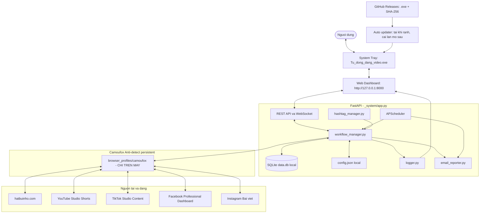

# SYSTEM_MAP.MD — SƠ ĐỒ HỆ THỐNG & QUY TẮC PHÁT TRIỂN

> [!IMPORTANT]
> ### QUY TẮC ĐẦU BẢNG: BẮT BUỘC ĐỌC KỸ TRƯỚC KHI SỬA ĐỔI HOẶC NÂNG CẤP MÃ NGUỒN
> 1. **KHÔNG TỰ Ý THAY ĐỔI CƠ CHẾ CHỌN SELECTOR** nếu chưa kiểm tra song ngữ (Anh - Việt) và lớp phủ popup (`react-joyride`, `dialog-scrim`, dialog Instagram).
> 2. **LUỒNG SẢN XUẤT:** YouTube / TikTok / Facebook hẹn native **công khai 10:00 sáng mai**. Instagram web **Share ngay** (Bài viết). Không Unlisted / Only you / Only me.
> 3. **CHỐNG ĐĂNG TRÙNG:** Video sau khi đăng cập nhật `posted` và không được chọn đăng lại.
> 4. **VIDEO ĐỦ ĐIỀU KIỆN:** Chế độ tự động lấy video có nhãn **Chưa tải xuống** trong tab **Đã xong** của HatBuiNho, kể cả video vừa hoàn tất trong ngày (`exclude_today = False`).
> 5. **KIỂM THỬ TRÊN TRÌNH DUYỆT THẬT** (`test_*_retry.py` / `test_full_suite.py` hoặc `.exe`).
> 6. **KHÔNG ĐẨY LÊN GITHUB:** cookie / `browser_profiles`, `.env`, `config.json` (mật khẩu), `data.db`, `.exe`. User tải `.exe` từ **GitHub Releases**, không từ git.
> 7. **ĐỒNG BỘ GITHUB SAU KHI ĐÓNG GÓI:** Sau khi đóng gói xong (`build_exe.py` hoặc sửa đổi mã nguồn), BẮT BUỘC phải đưa mã nguồn cập nhật lên GitHub (`git add`, `git commit`, `git push origin main` hoặc `publish_github_release.py`) để đảm bảo code trên GitHub luôn được đồng bộ mới nhất.

---

## MỤC LỤC
1. [Sơ Đồ Kiến Trúc Hệ Thống](#1-sơ-đồ-kiến-trúc-hệ-thống)
2. [Bản Đồ Cấu Trúc File](#2-bản-đồ-cấu-trúc-file)
3. [GitHub Release — User tải về & chống leak](#3-github-release--user-tải-về--chống-leak)
4. [Hai Chế Độ Đăng & Luồng Cốt Lõi](#4-hai-chế-độ-đăng--luồng-cốt-lõi)
5. [Kho Hàng Đợi FIFO & Chống Đăng Trùng](#5-hệ-thống-kho-hàng-đợi-fifo--chống-đăng-trùng)
6. [Báo Cáo Email](#6-module-độc-lập-báo-cáo-email)
7. [REST API & WebSocket](#7-danh-sách-rest-api--websocket)
8. [Giao Diện Dashboard](#8-giao-diện-dashboard)
9. [Quy Tắc Kỹ Thuật Bất Biến](#9-các-quy-tắc-kỹ-thuật-bất-biến)
10. [Cơ Sở Dữ Liệu & Cấu Hình](#10-cấu-trúc-cơ-sở-dữ-liệu--cấu-hình)
11. [Khắc Phục Lỗi Nhanh](#11-bảng-tra-cứu--khắc-phục-lỗi-nhanh)

---

## 1. SƠ ĐỒ KIẾN TRÚC HỆ THỐNG


```mermaid
graph TD
    User([Nguoi dung]) <--> Tray[System Tray: Tu_dong_dang_video.exe]
    Tray <--> Dashboard[Web Dashboard: http://127.0.0.1:8000]
    GhRelease[GitHub Releases: .exe + SHA-256] --> Updater[Auto updater: tai khi ranh, cai lan mo sau]
    Updater --> Tray

    subgraph CoreBackend [FastAPI - _system/app.py]
        API[REST API va WebSocket]
        Scheduler[APScheduler]
        WorkflowMgr[workflow_manager.py]
        DB[(SQLite data.db local)]
        ConfigMgr[config.json local]
        Logger[logger.py]
        HashtagMgr[hashtag_manager.py]
        EmailReporter[email_reporter.py]
    end

    subgraph BrowserEngine [Camoufox Anti-detect persistent]
        Browser[browser_profiles/camoufox - CHI TREN MAY]
    end

    subgraph Platforms [Nguon tai va dang]
        HatBuiNho[hatbuinho.com]
        YT[YouTube Studio Shorts]
        TT[TikTok Studio Content]
        FB[Facebook Professional Dashboard]
        IG[Instagram Bai viet]
    end

    Dashboard <--> API
    API <--> WorkflowMgr
    Scheduler --> WorkflowMgr
    WorkflowMgr <--> DB
    WorkflowMgr <--> ConfigMgr
    WorkflowMgr --> Logger --> Dashboard
    WorkflowMgr --> Browser
    Browser <--> HatBuiNho
    Browser <--> YT
    Browser <--> TT
    Browser <--> FB
    Browser <--> IG
    HashtagMgr --> WorkflowMgr
    WorkflowMgr --> EmailReporter
    Scheduler --> EmailReporter
```

---

## 2. BẢN ĐỒ CẤU TRÚC FILE

```
Auto_Dang_video/
├── README.md                   # Link tải Releases + hướng dẫn user
├── Huong_dan_su_dung.txt
├── .gitignore                   # Chặn cookie, config.json, .exe, .env, data.db
├── Tu_dong_dang_video.exe       # CHỈ trên máy / GitHub Release — KHÔNG commit git
├── downloads/                  # Video .mp4 (gitignore nội dung)
│
└── _system/
    ├── app.py                  # FastAPI: REST, WebSocket logs
    ├── tray_app.py             # Tray icon + uvicorn 127.0.0.1:8000
    ├── config.json             # Local: mật khẩu HatBuiNho — gitignore
    ├── config.example.json      # Mẫu public: username/password trống
    ├── .env                    # VILAO_API_KEY — gitignore
    ├── .env.example            # Mẫu public
    ├── data.db                 # SQLite local — gitignore
    ├── VERSION                 # Số phiên bản; publish tự tăng số giữa (1.2.0 → 1.3.0)
    ├── SYSTEM_MAP.MD           # Tài liệu này
    ├── build_exe.py           # PyInstaller onefile (add-data: static + config.example.json + VERSION)
    ├── build_exe.bat
    ├── publish_github_release.py   # CÁCH PHÁT HÀNH CHÍNH THỨC: đóng gói exe + Release
    ├── publish_github_release.bat
    ├── run.bat
    ├── backup_to_github.bat   # Chỉ đẩy mã nguồn (không .exe); ưu tiên dùng publish_github_release
    ├── requirements.txt
    ├── requirements.lock       # Dependency runtime riêng đã khóa phiên bản
    ├── core/update_manager.py  # Kiểm tra/tải/xác minh/cài EXE lần mở sau + rollback
    ├── .runtime/auto-dang-video/ # Python/browser/cache/temp riêng — gitignore
    ├── test_full_suite.py
    ├── test_fb_retry.py / test_tt_retry.py / test_ig_retry.py
    │
    ├── core/
    │   ├── config_manager.py   # DEFAULT_CONFIG username/password trống; đọc config.json local
    │   ├── database.py
    │   ├── email_reporter.py
    │   ├── schedule_helper.py   # Native 10:00 sáng mai; Instagram min_gap_hours
    │   ├── logger.py
    │   └── autostart_manager.py
    │
    ├── automation/
    │   ├── browser_engine.py  # Persistent Camoufox với executable/profile riêng
    │   ├── browser_runtime.py # Cài/kiểm SHA, manifest, owner, mutex app/profile
    │   ├── hashtag_manager.py   # Kho đạo lý + gộp hashtag AI khi tải
    │   ├── hatbuinho_crawler.py
    │   ├── ai_fallback.py      # Hashtag AI khi tải; recover UI khi lỗi
    │   ├── workflow_manager.py
    │   └── posters/
    │       ├── base_poster.py  # caption = tiêu đề + hashtags; append_text mặc định trống
    │       ├── youtube_poster.py
    │       ├── tiktok_poster.py
    │       ├── facebook_poster.py
    │       └── instagram_poster.py
    │
    ├── scheduler/task_scheduler.py
    ├── static/                 # Dashboard (index.html, css, js)
    └── browser_profiles/camoufox/  # Cookie phiên đăng nhập Camoufox — gitignore, KHÔNG lên GitHub
```

---

## 3. GITHUB RELEASE — USER TẢI VỀ & CHỐNG LEAK

Repo: https://github.com/ngonco/dangvideo

### User tải và cài

- **Link tải .exe:** https://github.com/ngonco/dangvideo/releases/latest
- File: `Tu_dong_dang_video.exe` (ví dụ `v1.2.0`).
- Từ `v1.12.0`: tự kiểm tra lúc mở và mỗi 6 giờ; tải khi workflow rảnh, xác minh file `.sha256`, cài ở lần mở tiếp theo và tự rollback nếu bản mới không khởi động.
- Click đúp → Dashboard `http://127.0.0.1:8000` → điền HatBuiNho trên Dashboard → **Mở Trình Duyệt Đăng Nhập** từng kênh một lần.
- Mã nguồn (không gồm .exe): ZIP nhánh `main`. Copy `config.example.json` → `config.json` nếu chạy từ Python.

### 3.1. Quy trình bắt buộc sau khi đóng gói xong

> [!IMPORTANT]
> **SAU KHI ĐÓNG GÓI XONG THÌ PHẢI ĐƯA LÊN GITHUB**:
> Bất cứ khi nào hoàn tất quá trình đóng gói (`build_exe.py` hoặc sửa đổi mã nguồn), bắt buộc phải đẩy mã nguồn lên GitHub ngay lập tức để đồng bộ repository:
> 1. Kiểm tra `git status` đảm bảo không bị dính file nhạy cảm (`config.json`, `.env`, `data.db`, `.exe`, `browser_profiles/`).
> 2. Chạy commit và push mã nguồn lên nhánh chính:
>    ```bash
>    git add .
>    git commit -m "Nội dung cập nhật sau khi đóng gói"
>    git push origin main
>    ```
> 3. Nếu muốn phát hành bản chạy mới cho người dùng tải `.exe`, chạy `python _system/publish_github_release.py` để tự động tạo GitHub Release kèm file `.exe`.

### Phát hành bản mới — cách chính thức duy nhất

Không làm tay từng bước. Sau khi sửa code, **chỉ chạy**:

```
python _system/publish_github_release.py
```

hoặc click [`_system/publish_github_release.bat`](publish_github_release.bat).

**Tự tăng version:** mỗi lần chạy (không `--tag`) script tăng **số giữa trước khi đóng gói**: `1.2.0` → `1.3.0` → `1.4.0`. Ghi `_system/VERSION` và nhãn Dashboard. Tag GitHub đã có thì tăng tiếp đến khi trống. Không ghi đè Release cũ.

Muốn chỉ định số (không tự tăng):

```
python _system/publish_github_release.py --tag v1.5.0
```

Script lần lượt:

1. Kiểm tra repo `ngonco/dangvideo`, nhánh `main`.
2. Tự tăng VERSION (số giữa) rồi đóng gói `Tu_dong_dang_video.exe` bằng `build_exe.py` (`--noconsole --onefile`; `--add-data config.example.json` + `VERSION` — không nhét mật khẩu local). Dashboard trong `.exe` hiện đúng số mới.
3. `git add` mã nguồn (gitignore chặn cookie/mật khẩu/.exe) → commit nếu có thay đổi → `git push origin main`.
4. Tạo GitHub Release ở trạng thái nháp, đính `.exe` + `.exe.sha256`, sau đó mới công khai. Không ghi đè tag cũ.
5. In link `releases/latest`.

Không cần sửa `_system/VERSION` tay. Dashboard đọc file này qua `/api/system/version`.

Không `git add` các mục gitignore dưới đây. Không in token GitHub. User lấy file từ Releases, không từ git.

### Cấm đưa lên GitHub

| Mục | Lý do |
| :--- | :--- |
| `_system/browser_profiles/` | Cookie / session YouTube, TikTok, Facebook, Instagram, HatBuiNho |
| `_system/config.json` | Mật khẩu HatBuiNho trên máy |
| `_system/.env` | `VILAO_API_KEY` |
| `_system/data.db` | Lịch sử đăng local |
| `Tu_dong_dang_video.exe` | File lớn; phát hành qua Releases |
| `downloads/*.mp4`, `debug_screenshots/`, `temp_record_action/` | Dữ liệu máy |

Public trên git: `config.example.json` (username/password trống), `.env.example`, mã nguồn, README.

`DEFAULT_CONFIG` trong `config_manager.py` cũng để username/password **trống**. Lần đầu chạy `.exe` tự tạo `config.json` local.

---

## 4. HAI CHẾ ĐỘ ĐĂNG & LUỒNG CỐT LÕI

### 4.1. Đăng tự động hàng ngày
- Mặc định `auto_mode = true`. Ngay khi ứng dụng mở, scheduler kiểm tra xem hôm nay đã có ít nhất một `video_id` đăng thành công hay chưa; nếu chưa thì đăng ngay 1 video.
- Sau lần kiểm tra lúc mở app, scheduler kiểm tra lại mỗi **30 phút**. Nếu hệ thống đang bận, kho chưa có video hợp lệ hoặc chưa kênh nào đăng thành công, lần kiểm tra kế tiếp sẽ thử lại.
- Khi một kênh bất kỳ đã ghi nhận `success` cho video trong ngày, các lần kiểm tra còn lại của ngày đó chỉ bỏ qua, không tạo thêm lượt đăng tự động. Sang ngày mới cơ chế tự hoạt động lại.
- Kho rỗng → `scan_and_download(..., exclude_today=False)`; video đã nằm trong tab **Đã xong** và có nhãn **Chưa tải xuống** thì được tải ngay, kể cả tạo hôm nay.
- `post_time_slots` không còn kích hoạt đăng; chúng chỉ chọn mốc công khai native kế tiếp. YT / TT / FB tải lên ngay và hẹn công khai; Instagram là Bài viết Share ngay, chạy thật cách **3 tiếng**.

### 4.2. Đăng hàng loạt theo lịch
- Nút Dashboard → `POST /api/action/batch-download-queue` (tối đa 50 video Chưa tải xuống). Scheduler lấy FIFO 1 video/ngày ngay khi có cơ hội.

### 4.3. Đăng 1 video ngay
- `POST /api/action/run-workflow` (`mode=normal`): ưu tiên Chưa tải xuống (hết thì video mới nhất) hoặc kho. `enforce_ig_gap=True`. Hẹn native theo `schedule_publish.default_time` (mặc định 10:00).

---

## 5. HỆ THỐNG KHO HÀNG ĐỢI FIFO & CHỐNG ĐĂNG TRÙNG

- **FIFO:** `status = 'downloaded' ORDER BY id ASC LIMIT 1`.
- **Cơ chế Chống Đăng Trùng 4 Lớp Thép:**
  1. **Lớp 1 (HatBuiNho Crawler):** Trích xuất `item_hash` từ kịch bản và `source_media_key` từ timestamp URL media. Chỉ bỏ qua khi đúng **cùng phiên bản media** đã hoàn tất; cùng kịch bản nhưng HatBuiNho render media mới vẫn được tạo thành video mới. Bản media cũ còn thiếu kênh được tải phục hồi vào đúng bản ghi cũ.
  2. **Lớp 2 (Sau khi tải - Dung lượng byte `file_size`):** Đo kích thước tệp video tải về. Đối chiếu `db.get_video_by_file_size(file_size)`. Nếu phát hiện tệp có dung lượng byte trùng 100% với video đã có trong DB, xóa ngay tệp vừa tải và chặn đăng lại.
  3. **Lớp 3 (Cơ sở dữ liệu SQLite):** Ràng buộc `hatbuinho_id TEXT UNIQUE`. Khi thực hiện `ON CONFLICT`, bảo vệ trạng thái: tuyệt đối không cho phép ghi đè video đã đăng (`posted`) hoặc đã dọn (`cleaned`) ngược trở lại thành `downloaded`.
  4. **Lớp 4 (Phân phối theo từng kênh riêng lẻ):** Trước khi đăng lên từng nền tảng (`youtube`, `tiktok`, `facebook`, `instagram`), kiểm tra `post_history`. Nếu kênh đó đã từng đăng thành công video này trước đó, tự động bỏ qua (`skipped`) để tránh đăng trùng lặp trên cùng 1 kênh.
- **Hoàn tất đa kênh:** Video chỉ chuyển sang `posted` sau khi tất cả kênh đang bật đã có lịch sử `success`. Nếu còn kênh thất bại hoặc bị hoãn, video giữ `downloaded` để lần sau đăng tiếp đúng kênh còn thiếu.
- **Phục hồi sau dọn file:** Nếu HatBuiNho báo `Chưa tải xuống` nhưng hash đã có trong DB ở trạng thái `cleaned`, app kiểm tra lịch sử từng kênh. Đã đủ kênh thì chặn trùng; còn thiếu kênh thì tải phục hồi file vào chính bản ghi cũ rồi chỉ đăng nốt kênh thiếu.
- **Xử lý khi kho rỗng & hết video mới:**
  - Chế độ tự động (Scheduler): Dừng lại an toàn, ghi log thông báo, tuyệt đối không tự ý tải lại video cũ.
  - Nút thủ công "Đăng 1 video ngay": Khi hết video mới, hệ thống hiện hộp thoại cảnh báo xác nhận. Người dùng bấm "Đồng ý" thì mới thực hiện ép tải lại (`force_repost=True`).

---

## 6. MODULE ĐỘC LẬP BÁO CÁO EMAIL

- SMTP: `binhyentram89@gmail.com` (Gmail SSL 465). Admin: `thv.vinh@gmail.com`.
- `send_error_alert` khi lỗi kênh; `send_daily_summary` lúc 22:00.

---

## 7. DANH SÁCH REST API & WEBSOCKET

| Method | Đường dẫn | Chức năng |
| :--- | :--- | :--- |
| `GET` | `/` | Dashboard |
| `GET` | `/media/{filename}` | File video trong `downloads/` |
| `GET` | `/api/system/version` | Phiên bản |
| `GET` | `/api/system/update/status` | Trạng thái/progress tự cập nhật EXE |
| `GET` | `/api/system/browser-runtime` | Trạng thái `installing|ready|error`, app/version và đường dẫn rút gọn; không trả cookie |
| `GET` | `/api/stats` | Số liệu tổng |
| `GET` | `/api/videos` | Danh sách video kho |
| `GET` | `/api/videos/{video_id}/history` | Lịch sử theo 1 video |
| `GET`/`POST` | `/api/config` | Đọc/lưu `config.json` local (hỗ trợ deep merge `platforms`) |
| `GET` | `/api/accounts/status` | Cookie/session các kênh |
| `GET` | `/api/facebook/pages` | Quét danh sách các Fanpage do tài khoản Facebook quản trị |
| `GET` | `/api/history` | Lịch sử đăng |
| `GET` | `/api/queue/summary` | Kho hàng đợi (số lượng & ngày dự kiến) |
| `GET` | `/api/queue/videos` | Danh sách chi tiết các video đang chờ trong kho |
| `POST` | `/api/videos/{video_id}/open-player` | Mở tệp video bằng trình phát mặc định của Windows (VLC/Media Player) |
| `DELETE` | `/api/videos/{video_id}/queue` | Hủy bỏ & xóa tệp video khỏi kho hàng đợi |
| `POST` | `/api/action/open-downloads-folder` | Mở thư mục downloads trong File Explorer |
| `POST` | `/api/action/open-logs-folder` | Mở thư mục logs trong File Explorer |
| `GET` | `/api/logs` | Nhật ký (in-memory gần nhất) |
| `GET` | `/api/logs/file` | Đọc nội dung file app.log |
| `GET` | `/api/logs/download` | Tải về file app.log |
| `GET`/`POST` | `/api/system/autostart` | Trạng thái / bật tắt khởi động Windows |
| `POST` | `/api/schedule/timeslots` | Mốc giờ + reload scheduler |
| `POST` | `/api/action/toggle-scheduler` | Bật/tắt auto |
| `POST` | `/api/action/scan` | Quét HatBuiNho |
| `POST` | `/api/action/post` | Đăng video đã chọn |
| `POST` | `/api/action/run-workflow` | Đăng 1 video (ưu tiên kho / chưa tải; popup xác nhận khi hết video mới) |
| `POST` | `/api/action/batch-download-queue` | Tải hàng loạt vào kho |
| `POST` | `/api/action/cleanup` / `cleanup-old-videos` | Dọn mp4 cũ |
| `POST` | `/api/action/send-test-email` | Email thử |
| `POST` | `/api/action/open-login` | Mở URL đăng nhập |
| `POST` | `/api/browser/open-login/{platform}` | Mở trình duyệt persistent theo kênh |
| `POST` | `/api/system/update/check` | Kích hoạt kiểm tra GitHub Release trong nền |
| `POST` | `/api/system/update` | Alias tương thích cho `/api/system/update/check` |
| `WS` | `/ws/logs` | Nhật ký realtime |

---

## 8. GIAO DIỆN DASHBOARD

Một trang cuộn duy nhất:
1. **Hero Card**: 3 nút chính (Bật/Tắt tự động, Đăng hàng loạt theo lịch, Đăng 1 video ngay), 2 nút cấu hình trình duyệt (Tắt tiếng, Hiển thị quá trình đăng), và Khung hẹn giờ đăng video.
2. **Accordion Đăng Nhập**: 5 kênh (HatBuiNho + 4 MXH YouTube, TikTok, Facebook, Instagram).
3. **Kho Video Chờ Đăng (Hàng Đợi)**: Danh sách thẻ trực quan các video đã tải về máy, gồm thứ tự FIFO (#1 tiếp theo, #2...), tiêu đề, hashtag, dung lượng MB, nút **Xem Video** (mở Windows Player), nút **Đăng Ngay** và nút **Bỏ Video**.
4. **Bảng Danh Sách Video Đã Đăng**: Lịch sử đăng bài kèm liên kết trực tiếp tới từng nền tảng.
5. **Accordion Cài Đặt Nâng Cao**: Khởi động cùng Windows, dọn dẹp video, email báo cáo & nhật ký WebSocket realtime.

---

## 9. CÁC QUY TẮC KỸ THUẬT BẤT BIẾN

### Quy Tắc 1: Cấm regex `i` trong selector Playwright
- Sai: `button:has-text("Đăng" i)`. Đúng: hai locator Anh/Việt hoặc `page.evaluate`.

### Quy Tắc 2: Overlay
- TikTok: `_dismiss_overlays`. Instagram: `_dismiss_ig_dialogs`. YouTube: `click(force=True)` / `evaluate`.

### Quy Tắc 3: Song ngữ Anh - Việt

### Quy Tắc 4: Hẹn native theo mốc đăng kế tiếp (trừ Instagram)
- **YouTube / TikTok / Facebook:** Schedule / Lên lịch công khai theo mốc kế tiếp trong `schedule.post_time_slots`; cấu hình hiện tại là `11:30, 20:00`. Nếu không có danh sách mốc thì dùng `schedule_publish.default_time` và `target_date`.
  - **Facebook (Trang cá nhân & Fanpage):** Hỗ trợ linh hoạt cả 2 chế độ (chọn trên Web Dashboard):
    - `target_type = "personal"` (mặc định): Tự động chuyển về Trang cá nhân nếu phiên duyệt đang ở Fanpage (`_ensure_switched_to_personal`), sau đó lên lịch Reels trên Professional Dashboard cá nhân.
    - `target_type = "fanpage"`: Người dùng bấm "Quét Trang" (`GET /api/facebook/pages`) và chọn 1 Fanpage cụ thể trong dropdown. Trước khi đăng, hệ thống tự động chuyển profile sang Fanpage đã chọn (`_ensure_switched_to_fanpage`). Nếu ở chế độ Fanpage nhưng chưa chọn trang mục tiêu (`page_url` rỗng), hệ thống tự động bỏ qua đăng Facebook an toàn (`skipped`), các kênh khác vẫn đăng bình thường.
  - **TikTok:** `tiktokstudio/content` → Tải lên → `#panel-video input[type=file]` → radio `postSchedule=schedule` → timepicker → `post_video_button` Lên lịch; copy link tab Bài đăng.
- **Instagram:** Bài viết / Post (không Story/Reel). Không `[role=switch]`, không Cài đặt nâng cao. Share / Chia sẻ (đúng chữ, không sheet Chia sẻ bài viết). Xong / Done → mở ô lưới đầu → `page.url` (`/p/` hoặc `/reel/`). Chạy thật: `instagram.min_gap_hours=3`.
- `schedule_publish`: `enabled=true`; `default_time=10:00`, `target_date=tomorrow` chỉ là fallback khi không có mốc kế tiếp.

### Quy Tắc 5: DummyWriter khi `--noconsole`

### Quy Tắc 6: Auto mode `exclude_today=False`; tab **Đã xong** + nhãn **Chưa tải xuống** là điều kiện sẵn sàng. Nút thủ công vẫn cho phép chọn/đăng lại theo xác nhận.

### Quy Tắc 7: HatBuiNho cookie-first & Cơ Chế Tải Đa Phiên Bản / Đơn Bản
- Có `#btn_view_history` thì không điền form. Thiếu username/password trên Dashboard thì không spam login. Đóng Đã đọc → Video → tab Đã xong.
- **Nút tải linh hoạt:** Hỗ trợ tìm và bấm cả nút "Tải xuống" và "Tải lại" trên thẻ video/panel phiên bản.
- **Phiên bản & Tải xuống:**
  - **Video đơn bản (1 bản duy nhất / không có tab phụ):** Bấm trực tiếp nút "Tải xuống" / "Tải lại" của thẻ video để mở `#download_reminder_modal`.
  - **Video đa phiên bản (có từ 2 tab `.history-variant-tab` trở lên):** Tự động phân tích timestamp tạo video từ link media (`YYYYMMDD_HHMMSS`), ưu tiên chọn phiên bản mới nhất và kiểm tra HTTP 200 còn sống trên CDN. Nếu bản mới nhất bị lỗi 404 (do file cũ hết hạn), tự động fallback sang phiên bản khác còn sống. Chuyển tab sang phiên bản đã chọn và bấm nút "Tải xuống" trong panel tương ứng.
  - **Tải tệp & Cơ chế dự phòng kép:** Ưu tiên bấm `#btn_confirm_download_2` ('Tải xuống 2 - có tên') qua Playwright download. Nếu trình duyệt báo hủy (`canceled`) hoặc lỗi, hệ thống tự động kích hoạt **Cơ chế tải trực tiếp dự phòng** qua stream URL media về thư mục `downloads/` và gọi API ghi nhận `postTrackDownload`. Nếu toàn bộ link của video đều 404, ghi nhật ký cảnh báo và tự động chuyển sang video tiếp theo.
  - **Chẩn đoán log:** Ghi rõ số lượng 'Chưa tải xuống' vs 'Đã tải xuống', phiên bản media mới/cũ, lý do bỏ qua (trùng đúng phiên bản Lớp 1, trùng byte dung lượng Lớp 2), và thông báo rõ khi toàn bộ video trên web đều đã tải xong.
  - **Lưu trữ Log:** Tự động ghi persistent log ra `_system/logs/app.log` (Rotating 5MB x 5 file, UTF-8), hỗ trợ mở thư mục và tải file log trên Dashboard.

### Quy Tắc 8: Hashtag & Ổn Định
- **Khi tải:** 100% sử dụng kho hashtag đạo lý phong phú nội bộ (`#luatnhanqua`, `#loiphatday`…), không phụ thuộc external AI để tránh lỗi 403 và độ trễ mạng. Cấm `#hatbuinho` / chữ ký thương hiệu (`custom_caption.append_text` mặc định trống).
- **Khi lỗi UI:** Tự động chụp ảnh màn hình lưu `debug_screenshots/`, ghi log chi tiết, không chặn tiến trình.

### Quy Tắc 9: Không leak khi push GitHub
- Không `git add` cookie, `.env`, `config.json`, `data.db`, `.exe`. Phát hành `.exe` bằng GitHub Release.

---

## 10. CẤU TRÚC CƠ SỞ DỮ LIỆU & CẤU HÌNH

### 10.1. Bảng `videos`
| Cột | Kiểu | Mô tả |
| :--- | :--- | :--- |
| `id` | INTEGER PK | |
| `hatbuinho_id` | TEXT UNIQUE | |
| `title` / `raw_script` / `suggested_title` | TEXT | |
| `hashtags` | TEXT | Đạo lý + AI phổ biến khi tải |
| `file_path` / `file_size` | | `downloads/` |
| `status` | TEXT | `downloaded` / `posted` / `cleaned` |

### 10.2. Bảng `post_history`
`platform` = youtube / tiktok / facebook / instagram. `status` = success / failed / skipped. `post_url` = permalink.

### 10.3. Cấu hình
- Local: `_system/config.json` (gitignore). Mẫu: `config.example.json`.
- `browser.headless=true` (mặc định): ẩn cửa sổ khi tải/đăng. Nút Dashboard **HIỂN THỊ QUÁ TRÌNH ĐĂNG** bật cửa sổ. **Mở Trình Duyệt Đăng Nhập** luôn hiện.
- `browser.mute_audio=true` (mặc định): Camoufox `media.volume_scale=0.0`. Nút Dashboard đổi được; trình duyệt của user không bị ảnh hưởng.
- `schedule_publish.default_time=10:00`, `target_date=tomorrow`.
- Scheduler kiểm tra cơ hội đăng ngay khi app mở và lặp cố định mỗi 30 phút cho tới khi ngày đó có video thành công.
- `platforms.facebook`: `target_type: "personal"` (mặc định), `page_name: ""`, `page_url: ""`.
- `custom_caption.append_text` trống (không `#hatbuinho`).
- `platforms.instagram.min_gap_hours=3`.

---

## 11. BẢNG TRA CỨU & KHẮC PHỤC LỖI NHANH

| Hiện tượng | Nguyên nhân | Cách xử lý |
| :--- | :--- | :--- |
| `stdout` None / `isatty` | PyInstaller `--noconsole` | `DummyWriter` trong `tray_app.py` / `logger.py` |
| `signal only works in main thread` | Uvicorn trong thread | `install_signal_handlers = lambda: None` |
| Profile trình duyệt bị khóa | Một phiên Auto Đăng Video khác đang giữ đúng `browser_profiles/camoufox` | Đóng phiên Auto Đăng Video cũ; không tắt Camoufox theo tên vì có thể thuộc Scan Viral |
| HatBuiNho không thấy video | Overlay Đã đọc / chưa bấm Video | `#btn_view_history` rồi `#history_tab_done` |
| TikTok draft / Continue to post | Bản nháp hoặc hộp xác nhận lịch | Discard; trong Continue to post bấm Post now (xác nhận lịch) |
| Facebook đăng tường / kẹt lịch | Sai composer; calendar che nút | Prodash Reel; helper text; Schedule footer; Copy link |
| Instagram không hẹn giờ | Web không có Lên lịch | Share ngay; copy `page.url` |
| YouTube Daily upload limit | Banner shadow DOM | Dừng kênh, email, không Next |
| YouTube 'Hết thời gian chờ đăng nhập' dù đã đăng nhập | Headless Chromium bị chặn bởi màn hình 'Improve your experience' (unsupported browser) | Set desktop Chrome User-Agent, truy cập kèm `?approve_browser_access=true`, tự động click 'Skip to YouTube Studio' và kiểm tra `studio.youtube.com/channel/` |
| User không có .exe trong git clone | `.exe` không nằm trong git | Tải https://github.com/ngonco/dangvideo/releases/latest |

Tài liệu này khớp mã nguồn hiện tại: native schedule, Instagram permalink thanh địa chỉ, hashtag AI khi tải, phát hành `.exe` qua GitHub Releases.

---

## 12. NHẬT KÝ THAY ĐỔI SYSTEM MAP

| Ngày | Tác giả | Thay đổi | Lý do |
| :--- | :--- | :--- | :--- |
| 2026-10-02 | Codex | v1.13.0: Hỗ trợ Facebook Reel kiểu chọn tệp trước qua file chooser rồi mở `/reels/create`; kiểm tra chú thích, nhãn AI, Public, ngày/giờ đọc lại và nút Schedule Post. Lấy link đúng hàng trong tab Scheduled bằng thao tác chuột thật; ưu tiên clipboard trình duyệt ẩn, hỗ trợ handle Windows 64-bit. YouTube tiếp tục bản nháp chỉ khi khớp cả tiêu đề và tên tệp, bấm nút HTML bên trong ytcp-button, hỗ trợ description/URL của host display:contents và xác nhận đúng video Scheduled/Public. Log EXE ghi vào thư mục `_system/logs` bền vững. | Video #21 bị kẹt Facebook do chờ hộp thoại trước khi chọn tệp; YouTube giữ Draft do nút Schedule cũ và không lấy được URL từ host mới. Đã xác minh lịch thật 10:00 ngày 03/10 trên hai kênh và lấy link Facebook tự động khi chạy ẩn, giữ chống trùng TikTok/Instagram. |
| 2026-09-27 | Codex | Sửa bộ chọn giờ TikTok bấm trực tiếp giá trị giờ/phút thay vì khối cha của bánh xe; bắt buộc đọc lại ô giờ và dừng trước nút Schedule nếu chưa khớp. | Kiểm tra đăng thật phát hiện mã cũ tìm đúng `11:30` nhưng mỗi lần bấm lại làm bánh xe tăng giờ, khiến bài chờ thành `22:30` trong khi log vẫn báo `11:30`. |
| 2026-09-27 | Codex | Định danh video theo phiên bản media HatBuiNho thay vì chỉ hash kịch bản; cho auto mode tải video trong tab Đã xong kể cả được tạo hôm nay. | HatBuiNho có thể render video mới cùng kịch bản cũ; hash chữ khiến app gộp nhầm và bỏ qua file media ngày 27/09. |
| 2026-09-27 | Codex | Sửa luồng hoàn tất đa kênh: không đánh dấu `posted` sau thành công đầu tiên; phục hồi file của video `cleaned` còn thiếu kênh; giữ nguyên chống trùng theo từng nền tảng. | HatBuiNho có thể vẫn báo `Chưa tải xuống` trong khi DB đã dọn file; trước đây crawler chặn theo hash quá sớm nên video thiếu kênh không thể được tải lại để hoàn tất. |
| 2026-09-27 | Codex | Đổi scheduler sang kiểm tra cơ hội đăng ngay khi mở app và mỗi 30 phút; chỉ dừng trong ngày sau khi có ít nhất một video đăng thành công; `post_time_slots` chỉ còn dùng chọn giờ công khai native. | Không bỏ lỡ lượt đăng khi máy mở sau khung giờ cố định, đồng thời không tự đăng trùng nhiều video trong cùng ngày. |
| 2026-09-26 | Codex | Thay `git pull` bằng bộ tự cập nhật EXE bắt buộc: GitHub Release ổn định, kiểm tra mỗi 6 giờ, tải khi rảnh, SHA-256, staging theo từng vị trí cài, cài ở lần mở sau, mutex một phiên bản, health-check và rollback; Release chỉ công khai sau khi có đủ EXE + checksum. | Cho máy người dùng tự nhận bản mới mà không cần Git/Python và không làm gián đoạn phiên đăng video. |
| 2026-09-26 | Codex | Kiểm tra đăng thật video #16 theo mốc 20:00; sửa Facebook không click tab Scheduled làm Camoufox thoát cứng, lấy permalink theo đúng caption từ DOM và chuẩn hóa URL sạch; cập nhật Instagram theo editor Lexical `Add a caption...`, chọn/xóa sạch nháp cũ, xác nhận nội dung và không Share nếu caption thất bại; thêm công cụ sửa caption bài đã đăng và xác minh lại trên tab mới. | Facebook đã lên lịch nhưng tiến trình lấy link thoát; Instagram đăng được nhưng selector caption cũ không còn khớp và caption đầu tiên cần được bổ sung lại. |
| 2026-09-26 | Codex | Siết permalink YouTube/TikTok/Facebook; không lưu URL hồ sơ/thư viện; tránh clipboard cũ; thêm công cụ khôi phục link; YouTube chỉ ghi thành công khi nút Schedule khả dụng và có hộp xác nhận `Video scheduled`, không còn coi hộp upload đóng là thành công. | Log và kiểm tra trình duyệt thật cho thấy ba Shorts mới vẫn là Draft nhưng DB ghi success và tái sử dụng link video cũ; TikTok/Facebook từng lưu URL hồ sơ thay vì permalink bài. |
| 2026-09-26 | Codex | Tách runtime Auto Đăng Video sang `_system/.runtime/auto-dang-video/`; thêm Python Embedded/lockfile, Camoufox browser/cache/temp riêng, cài staging + SHA-256, `runtime.json`, `owner.json`, mutex theo app/profile, executable tuyệt đối, API trạng thái/503, UI báo lỗi cài đặt và mọi launcher/build/update/publish dùng runtime riêng. Ép `platformdirs` về cache app-local trước lần import Camoufox đầu tiên vì Windows Known Folder không tuân theo `LOCALAPPDATA`. Bản portable nhúng runtime cũ được chuyển sang onefile tự cài browser lần đầu; release dùng artifact mới trong `_system` nên vẫn phát hành an toàn khi bản EXE gốc đang mở và bị Windows khóa. | Cho phép chạy đồng thời với Scan Viral mà không dùng cache/binary/mutex chung, không kill chéo browser, không commit gói gần 1 GB, không dừng workflow đang chạy để build và vẫn giữ nguyên cookie ở `_system/browser_profiles/camoufox/`. |
| 2026-09-26 | Codex | Truyền Firefox major 152 khớp binary app-local vào `AsyncCamoufox` và thêm hồi quy source contract. | Ngăn Camoufox 0.5.6 gọi `installed_verstr()` rồi báo `official/stable is not installed` khi cache riêng không có managed-install metadata dù `executable_path` tuyệt đối đã hợp lệ. |
